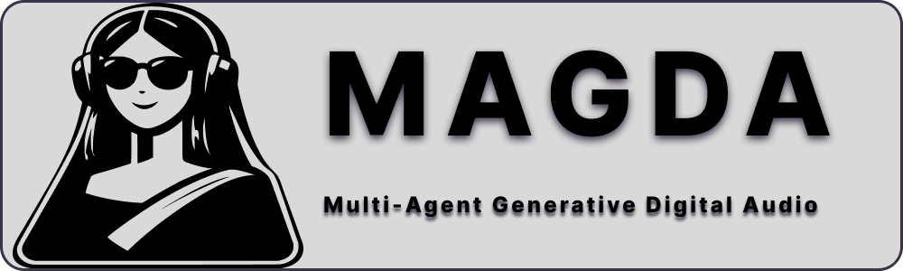

<p align="center">
  
</p>

<p align="center">
  <a href="https://github.com/Conceptual-Machines/magda-core/actions"></a>
  <a href="https://github.com/Conceptual-Machines/magda-core/blob/main/LICENSE"></a>
  
  
  <a href="https://github.com/codespaces/new?hide_repo_select=true&ref=main&repo=Conceptual-Machines/magda-core"></a>
</p>

<p align="center">
  Multi-Agent Generative Digital Audio
</p>
<p align="center"></p>

---

## Status

Early research and prototyping. Not yet ready for production use.

## Building

### Development Environment Options

#### Option 1: GitHub Codespaces / VS Code Dev Containers (Recommended for Quick Start)

The easiest way to get started is using the pre-configured development container:

**GitHub Codespaces (Cloud)**:
1. Click the green "Code" button on GitHub
2. Select "Codespaces" → "Create codespace"
3. Wait for the environment to initialize
4. Run `make setup && make debug`

**VS Code Dev Containers (Local)**:
1. Install [Docker Desktop](https://www.docker.com/products/docker-desktop) and [VS Code](https://code.visualstudio.com/)
2. Install the [Dev Containers extension](https://marketplace.visualstudio.com/items?itemName=ms-vscode-remote.remote-containers)
3. Open the project in VS Code
4. Click "Reopen in Container" when prompted
5. Run `make setup && make debug`

See [.devcontainer/README.md](.devcontainer/README.md) for more details.

#### Option 2: Local Development

**Prerequisites**:
- C++20 compiler (GCC 10+, Clang 12+, or Xcode)
- CMake 3.20+

**Quick Start**:
```bash
# Clone with submodules
git clone --recursive https://github.com/Conceptual-Machines/magda-core.git
cd magda-core

# Setup and build
make setup
make debug

# Run
make run
```

### Make Targets

```bash
make setup      # Initialize submodules and dependencies
make debug      # Debug build
make release    # Release build
make test       # Run tests
make clean      # Clean build artifacts
make format     # Format code
make lint       # Run clang-tidy analysis
```

## Automated Workflows

The project includes automated GitHub Actions workflows:

- **CI Workflow**: Runs on every push to validate builds and code quality
- **Security Scanning**: CodeQL analysis, secret detection, and vulnerability scanning
- **Periodic Code Analysis**: Weekly scans for TODOs, FIXMEs, and code smells
- **Refactoring Scanner**: Bi-weekly analysis of code complexity and technical debt

See [docs/AUTOMATED_WORKFLOWS.md](docs/AUTOMATED_WORKFLOWS.md) for details on automated analysis and periodic workflows.

## Security

MAGDA takes security seriously. The repository implements comprehensive security measures:

- 🔒 **Branch Protection**: Main branch protected with required reviews and status checks
- 🔍 **Automated Scanning**: CodeQL security analysis for C++ vulnerabilities
- 🔐 **Secret Detection**: Automated scanning to prevent credential leaks
- 🛡️ **Dependency Monitoring**: Dependabot for security updates
- ⚡ **CI/CD Security**: All security checks must pass before merge

**Found a security issue?** Please review our [Security Policy](SECURITY.md) for responsible disclosure.

For detailed information about branch protection and security architecture, see [docs/BRANCH_PROTECTION.md](docs/BRANCH_PROTECTION.md).

## Architecture

```
magda/
├── daw/        # DAW application (C++/JUCE)
│   ├── core/       # Track, clip, selection management
│   ├── engine/     # Tracktion Engine wrapper
│   ├── ui/         # User interface components
│   └── interfaces/ # Abstract interfaces
├── agents/     # Agent system (C++)
└── tests/      # Test suite
```

## Dependencies

- [Tracktion Engine](https://github.com/Tracktion/tracktion_engine) - Audio engine
- [JUCE](https://juce.com/) - GUI framework
- [Catch2](https://github.com/catchorg/Catch2) - Testing (fetched via CMake)
- [nlohmann/json](https://github.com/nlohmann/json) - JSON library (fetched via CMake)

## License

GPL v3 - see [LICENSE](LICENSE) for details.
