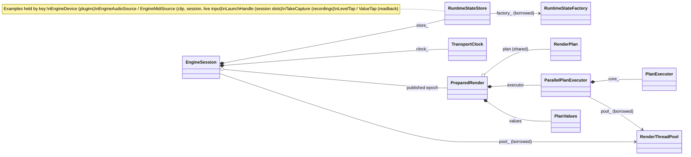

# Engine session class map

This is a small, source-checked view of the native engine's ownership and
references. It complements the rendering and publication flows in
[The native audio engine](native-engine.md). The diagram is curated: showing
every member and method would obscure the lifetime boundaries that matter here.

`*--` means a value member owned with its containing object, `o--` means a
shared lifetime, and `-->` means a borrowed reference or pointer. `PreparedRender`
is the private nested type in `EngineSession`; it holds the plan, executor and
initial values together so they retire as one epoch. `RuntimeStateStore` stays
on the session across those swaps, keeping devices and other runtime objects
alive while the model still names them. The thread pool belongs to the host and
must outlive the session. The note lists examples rather than every stored map;
the store also holds launch, recording and meter taps and device MIDI panic state.

The relationships above come from
[`EngineSession.hpp`](../../magda/engine/exec/EngineSession.hpp),
[`ParallelPlanExecutor.hpp`](../../magda/engine/exec/ParallelPlanExecutor.hpp), and
[`RuntimeStateStore.hpp`](../../magda/engine/exec/RuntimeStateStore.hpp). Check those
headers when changing the diagram; they are the source of truth.

## Generating more diagrams

The repository already renders Mermaid diagrams in architecture Markdown and
the CMake debug build produces `cmake-build-debug/compile_commands.json`. A
Clang-based generator such as [clang-uml](https://clang-uml.github.io/) can read
that compilation database and emit Mermaid class, sequence, package, and include
diagrams. Start with a small set of translation units and a namespace or class
filter; a graph of the whole application will be hard to read. The
[clang-uml class-diagram guide](https://clang-uml.github.io/md_docs_2class__diagrams.html)
shows the relevant filters.

Before adopting generated diagrams in the build, verify that the chosen
clang-uml release can parse this project's C++23 compile commands. Its current
documentation only claims support through C++20. Generated relationships also
show what the declarations express; they cannot explain why an object outlives a
plan swap or which thread may touch it. Keep those lifecycle and data-flow views
as small, reviewed diagrams alongside the generated ones.
