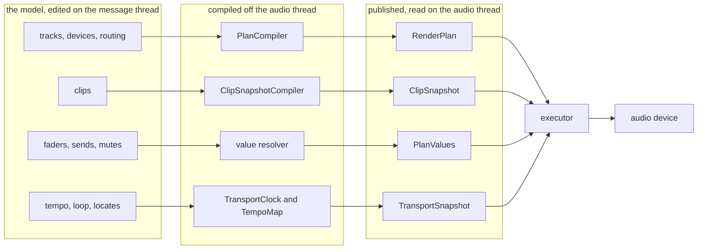
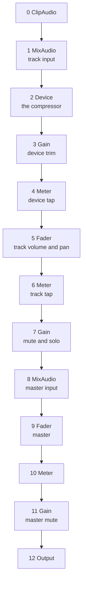
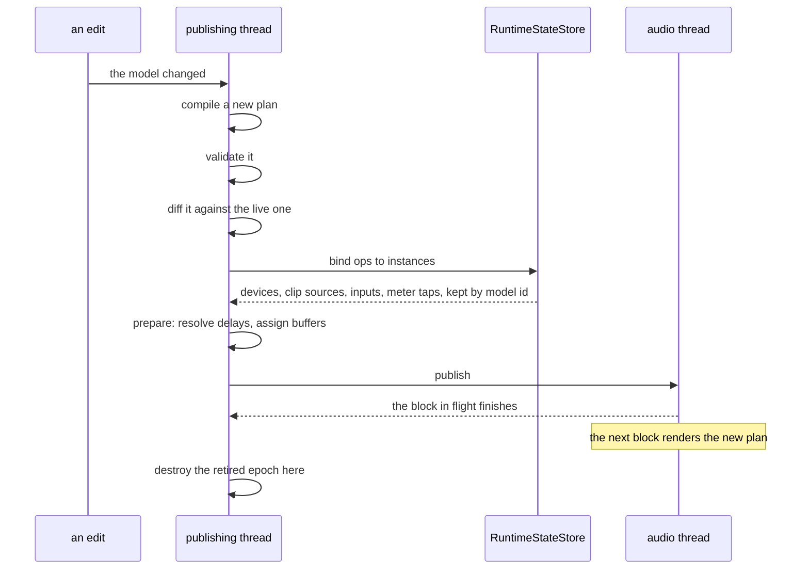
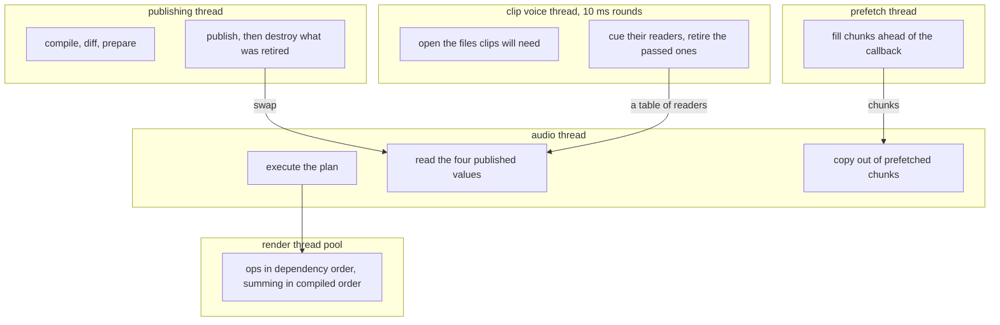
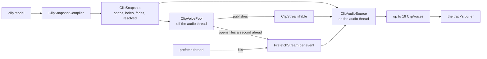
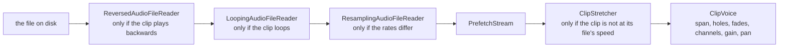

# The native audio engine

Epic [#1882](https://github.com/Conceptual-Machines/magda-core/issues/1882): a MAGDA-owned
audio engine that covers exactly what MAGDA uses Tracktion Engine for today, so the fork can
be removed.

It lives in `magda/engine/` as a static library, `magda_engine`, built on every configure and
linked by nothing but the tests. A configure-time check in `magda/engine/CMakeLists.txt`
refuses any file in there that includes Tracktion, or anything outside the model layer and its
own headers. Dark, but never rotting: it compiles the real model, and its tests run in every CI
job.

This document is the map. The territory is the header comments: every file in `magda/engine/`
opens with a block that explains what it is for and, more usefully, why it is shaped the way it
is. When the two disagree, the headers are right and this file is stale.

---

## 1. Where it stands

| Part | Issue | State |
| --- | --- | --- |
| Own JUCE as a direct dependency | [#1883](https://github.com/Conceptual-Machines/magda-core/issues/1883) | done |
| Break the TE to MAGDA reverse dependency | [#1884](https://github.com/Conceptual-Machines/magda-core/issues/1884) | done |
| Close the AudioEngine abstraction gap | [#1885](https://github.com/Conceptual-Machines/magda-core/issues/1885) | done |
| Device SDK seams, MagdaDevice base | [#1886](https://github.com/Conceptual-Machines/magda-core/issues/1886) | done |
| Engine-neutral device state schema | [#1887](https://github.com/Conceptual-Machines/magda-core/issues/1887) | done |
| Retire stock TE plugin wrappers | [#1888](https://github.com/Conceptual-Machines/magda-core/issues/1888) | done |
| Clip model: container from content | [#1901](https://github.com/Conceptual-Machines/magda-core/issues/1901) | done |
| **Engine core: plan, executor, PDC** | [#1889](https://github.com/Conceptual-Machines/magda-core/issues/1889) | **all 10 slices done** |
| **Arranger clip playback** | [#1890](https://github.com/Conceptual-Machines/magda-core/issues/1890) | **slices 1 to 6 of 7** |
| Parameters, modifiers, macros, automation | [#1891](https://github.com/Conceptual-Machines/magda-core/issues/1891) | not started |
| Rack graph: pins, summing, multi-out, nesting | [#1892](https://github.com/Conceptual-Machines/magda-core/issues/1892) | not started |
| External plugin hosting and hardware inserts | [#1893](https://github.com/Conceptual-Machines/magda-core/issues/1893) | not started |
| Clip launcher and session playback | [#1894](https://github.com/Conceptual-Machines/magda-core/issues/1894) | not started |
| Live input, monitoring, recording | [#1895](https://github.com/Conceptual-Machines/magda-core/issues/1895) | not started |
| Null-diff validation harness | [#1896](https://github.com/Conceptual-Machines/magda-core/issues/1896) | not started |
| Cutover: bridge rewrite, dual-engine release | [#1897](https://github.com/Conceptual-Machines/magda-core/issues/1897) | not started |

Engine core, slice by slice: plan IR and compiler ([#2010](https://github.com/Conceptual-Machines/magda-core/issues/2010)),
reference executor and value layer ([#2011](https://github.com/Conceptual-Machines/magda-core/issues/2011)),
runtime state and epoch retirement ([#2012](https://github.com/Conceptual-Machines/magda-core/issues/2012)),
latency compensation and buffer assignment ([#2013](https://github.com/Conceptual-Machines/magda-core/issues/2013)),
the plan differ ([#2014](https://github.com/Conceptual-Machines/magda-core/issues/2014)),
transport and tempo ([#2015](https://github.com/Conceptual-Machines/magda-core/issues/2015)),
disk reader and prefetch ([#2016](https://github.com/Conceptual-Machines/magda-core/issues/2016)),
offline render and taps ([#2017](https://github.com/Conceptual-Machines/magda-core/issues/2017)),
parallel executor ([#2018](https://github.com/Conceptual-Machines/magda-core/issues/2018)),
crossfading a plan swap ([#2019](https://github.com/Conceptual-Machines/magda-core/issues/2019)).

Clips, slice by slice: the snapshot ([#2034](https://github.com/Conceptual-Machines/magda-core/issues/2034)),
voices, spans and fades ([#2035](https://github.com/Conceptual-Machines/magda-core/issues/2035)),
rate conversion, looping and reverse ([#2036](https://github.com/Conceptual-Machines/magda-core/issues/2036)),
stretch and pitch ([#2037](https://github.com/Conceptual-Machines/magda-core/issues/2037)),
warp, beat detection and loop info ([#2038](https://github.com/Conceptual-Machines/magda-core/issues/2038)),
MIDI clips ([#2039](https://github.com/Conceptual-Machines/magda-core/issues/2039)).
Still open: the null-diff corpus ([#2040](https://github.com/Conceptual-Machines/magda-core/issues/2040)).

---

## 2. The one idea

An audio callback may not wait, may not allocate and may not free. Everything else follows from
arranging the engine so it never has to.

So nothing the audio thread reads is ever edited. Four separate immutable values are compiled
off the audio thread and swapped in whole, and the audio thread only ever reads the current
one. They are separate because they change at wildly different rates, and lumping them together
would make a fader move cost what a device move costs.



What travels on which channel, and what it costs:

| Channel | Carries | Changes when | Cost of a change |
| --- | --- | --- | --- |
| `RenderPlan` | signal topology only | a device moves, a track is added, a chain is bypassed | a compile, at human speed |
| `PlanValues` | gains, faders, pans, sends, mutes | a mixer move | resolve a flat table, no compile |
| `ClipSnapshot` | what every track plays, resolved | a clip moves, is trimmed, is faded | recompile the snapshot, no plan touched |
| `TransportSnapshot` | tempo, loop, metronome, and where the transport has been asked to be | a tempo edit, a loop drag, a locate | published like the others |

The transport row is the one to read carefully, because its name invites the wrong reading. The
snapshot is the clock's **input**, not a per-block reading of it: where the timeline actually is
belongs to `TransportClock::advance`, which owns that cursor on the audio thread and exposes the
position separately. Nothing is published every block.

The rule of thumb, and the one worth remembering: **moving a clip or a fader never recompiles a
plan.** If a change to the model forces a plan recompile, either it really is topology or
something has been put in the wrong channel.

---

## 3. What a plan is

A flat, dependency-ordered list of ops. Not a graph of objects: a vector you walk from top to
bottom, where every op names the ops it reads from by index. That is what makes it dumpable,
diffable and schedulable.

Here is a real one, from the compiler's golden test: one track, one device, into the master.

```
magda-render-plan v1
ops=13 outputs=1
[  0] ClipAudio   det   T1:clipAudio                   in=-                out=audio       deps=0
[  1] MixAudio    det   T1:trackAudioInput             in=0:0              out=audio       deps=1
[  2] Device      det   T1/D7:deviceProcess            in=1:0,-,-          out=audio       deps=1
[  3] Gain        det   T1/D7:deviceGain               in=2:0              out=audio       deps=1
[  4] Meter       det   T1/D7:deviceMeter              in=3:0              out=audio       deps=1
[  5] Fader       det   T1:trackFader                  in=4:0,-            out=audio       deps=1
[  6] Meter       det   T1:trackMeter                  in=5:0              out=audio       deps=1
[  7] Gain        det   T1:trackMute                   in=6:0              out=audio       deps=1
[  8] MixAudio    det   T-2:trackAudioInput            in=7:0              out=audio       deps=1
[  9] Fader       det   T-2:trackFader                 in=8:0,-            out=audio       deps=1
[ 10] Meter       det   T-2:trackMeter                 in=9:0              out=audio       deps=1
[ 11] Gain        det   T-2:trackMute                  in=10:0             out=audio       deps=1
[ 12] Output      det   T-2:hardwareOutput             in=11:0             out=-           deps=1
ready=0
```

`T-2` is the master. `det` is the op's liveness domain: whether what it computes is the same
every time it is asked, or depends on something live arriving. It is read today, in two places.
`validatePlan` checks it both ways, so a deterministic op can never read a live one and a live
op can never appear without a live source behind it, and the crossfade pass refuses to introduce
a live producer ahead of a deterministic consumer. Its larger purpose is still ahead of it: the
anticipative executor ([#1898](https://github.com/Conceptual-Machines/magda-core/issues/1898))
is what the tag was carried from day one for.



Two things that look like clutter and are not:

**An ordinary device is three ops.** Its processing, its gain trim and its meter tap are
separate, so the differ can carry, rebuild and crossfade each independently. A device whose trim
changed does not rebuild.

Three is the usual shape rather than a rule: an analysis device is a transparent passthrough
with no trim and no tap, so it compiles to a bare process op, and a compile with device meters
switched off emits no meter ops at all.

**Every op has a key.** `T1/D7:deviceGain` is the model location plus the structural role, and
`validatePlan` proves keys are unique. That key is how a new plan recognises an op in the old
one, which is the whole of section 4.

The op vocabulary is deliberately small: `ClipAudio`, `ClipMidi`, `AudioInput`, `MidiInput`,
`Device`, `MixAudio`, `MergeMidi`, `Delay`, `Crossfade`, `Gain`, `Fader`, `SendTap`, `Meter`,
`Output`.

---

## 4. The life of an edit



The parts that matter:

**The differ** (`plan/PlanDiff.hpp`) decides what survives. An op carries its state when the key,
the kind, the ports and the connected inputs all agree. That is what keeps delay lines full and
tails alive across an edit, and it is the answer to the rebuild click.

**The store** (`exec/RuntimeStateStore.hpp`) owns the expensive things an op resolves to:
devices, a track's clip sources, live inputs, meter taps. Keyed by model id rather than by plan
membership. A bypassed device contributes no ops at all, so keying on the plan would tear its
plugin down and rebuild it when you toggle bypass, losing tail, state and load time on a gesture
that should be free. Plan-named means playing; model-named means kept; only deletion from the
model destroys anything.

File readers are **not** here, and that is deliberate rather than an omission. A clip's readers
are opened and owned by `ClipVoicePool`, on its own thread, and reach the audio thread through
their own table; they never enter a plan epoch. Section 6 is where they live.

**Prepare** (`exec/PlanLayout.hpp`) is what a plan becomes when it meets the instances behind it.
How many samples each delay holds comes from what a loaded plugin reports, which the model
cannot know and the compiler never saw. A plugin whose latency changes therefore re-prepares
rather than recompiling.

**Publish** blocks the publishing thread until the audio thread finishes the block it is in.
That is the point: after it returns, nothing the audio thread can reach names the old epoch, so
the old epoch is destroyed right there, on the publishing thread. The callback never frees.

**Crossfade** (`plan/PlanCrossfade.hpp`) ramps the edges an edit moved. Fades are ops the
compiler never emitted, added by a pass over its output and gone again at the next publish.

---

## 5. Who runs what



The audio thread never allocates, never locks and never frees. Every other thread here exists so
that stays true.

The parallel executor deserves one line of its own: its output is **bit-identical** to the
single-threaded reference executor at every thread count, because everything that sums does so
in compiled order rather than in the order its inputs finished, and buffers are shared on a test
over the dependency graph rather than over the op list. The schedule costs nothing at run time,
because the dependency counts were baked into the plan when it was compiled.

---

## 6. How a clip plays



The snapshot is **resolved**: occlusion, crossfades and takes are worked out once, at compile
time, by the same model functions the UI draws with (`computeAudibleSpans` in
`core/ClipOcclusion.hpp`, `effectiveFadesIn` in `core/ClipFades.hpp`). A voice therefore plays a span with fades and
never looks at its neighbours. Two clips crossfading are two voices each playing the fade it was
handed, and nothing downstream pairs them up.

The pool runs a second ahead of the transport (`kCueAheadSeconds`), opening files and pointing
readers at the sample their clip starts on. That is the difference between a clip starting on
the beat and a clip starting a block late: a read that does not continue the last one is a seek,
and a seek costs a block of silence.

Two ceilings, and they answer different questions through different counters.

`kMaxVoicesPerTrack` is 16, and it is how many clips a track can sound in one callback. Past it,
the pool reports `overSubscribed`, which is peak concurrency beyond the ceiling, and the source
reports `starvedVoices` as the clips actually go unheard.

`kMaxReadersPerTrack` is twice that, because a reader has to exist before its clip is due. Past
it, the counter is `unbridged`, and `overSubscribed` stays at zero by design: a lane of
sequential slices fills the reader budget many times over without two of them ever sounding
together. A crowded one-second window is normally harmless, so only clips the budget turned away
that start within `kReadAheadBridgeSeconds`, which is to say clips that will be due before the
next round, count as unbridged.

None of the three is silent about it, because silence nobody counted is indistinguishable from a
gap in the material.

### The reading chain

Reverse, looping and rate conversion are not processing. They are which of a file's samples
answer a position, so each is a reader wrapped around the reader, built once when the pool opens
a clip.



Everything above the chain sees one forward file at the device's rate, whatever the clip is set
to. A clip that asks for none of it reads through no extra layer at all.

### Speed and pitch

Slice 4 ([#2037](https://github.com/Conceptual-Machines/magda-core/issues/2037)). The chain
above decides **what** the reading holds; this decides **how fast it is consumed**, which is why
it sits above the stream where the chain sits below it.

All of it is one function. `readingPositionAt` in `clip/EventPlacement.hpp` says where in the
reading a moment of the timeline sits, and everything on the list is that function answering
differently:

| What the clip asks for | What the position does |
| --- | --- |
| its file's own speed | advances one reading sample per output sample |
| a speed ratio | advances by the ratio, a constant, resolved in the snapshot |
| auto tempo | advances by the beats that have passed, times a beat of the file |
| analog pitch | advances by the ratio the model already folded the pitch into, with no stretcher |
| a speed ramp fade | the moment itself is warped near the clip's edge, and the rate with it |
| warp markers | advances through a compiled map whose rate changes at every marker |

Auto tempo is the one worth reading twice. Its ratio is the project's tempo over the file's own
and moves with the tempo curve, so it cannot be resolved to seconds ahead of a block. What saves
it is that the integral of that ratio is beats: the material an instant has consumed is how many
beats have passed since the event began, times what a beat of the file is worth. That is why the
clock publishes both faces of one instant, and why there is no second tempo map on the audio
thread.

### Warp

Slice 5 ([#2038](https://github.com/Conceptual-Machines/magda-core/issues/2038)), and it added
no machinery at all below the position map: the voice, the stretchers and the reading chain are
untouched by it. A block already asks `readingPositionAt` at both its ends and hands the
difference to the stretcher, so a ratio that changes at every marker costs nothing that a moving
auto-tempo ratio did not already cost.

The model holds warp as `(sourceTime, warpTime)` pairs, piecewise linear, slope 1 outside the
marker range. That direction answers where a bit of file lands musically, which is what the
editors ask. Playback asks the inverse, so `clip/WarpMap.hpp` compiles one: sorted, strictly
increasing on both sides, and with whatever could not be part of a monotonic map dropped at
compile time with a diagnostic rather than divided by on the audio thread.

Three things compose with it, and each is decided in one place:

- **Reverse** stays a coordinate change, as it is everywhere else in this layer. The map is not
  mirrored; a reversed event walks it backwards from the far end of what it reads and mirrors the
  answer. Mirroring the map instead would need the length of the region the event reads, which is
  itself an answer from the map. The incumbent cannot do reverse and warp together at all -- it
  bakes warp into a rendered proxy file and can only bake one thing per clip, so
  `WaveAudioClip::createRenderJob` returns the reverse job and the markers are silently lost.
- **Looping** is the one case where the reading chain cannot do its own tiling. Folding below the
  stream works because the reading advances linearly, and under warp it does not: a position that
  had already been through the map would fold in the wrong domain and every pass after the first
  would play straight. So a warped loop folds in warp time, above the map, and the tiling below is
  switched off. The reading then saws back at each wrap rather than climbing, which costs one seek
  per pass.
- **Stretcher sizing** reads the map's steepest segment rather than its average. A warped event
  has no single rate, and the pre-roll has to cover the fastest stretch of it.

Where the markers come from when the user has not placed them is the other half of the slice.
`analysis/TransientDetector.hpp` is the incumbent's detector reproduced coefficient for
coefficient -- envelope followers, a differentiator, a threshold from the sensitivity, a spacing
rule -- because a detector that found different transients would move every auto-detected marker
in every project that already has one. `io/SourceLoopInfo.hpp` is the third piece and is not an
analysis at all: a file's own tempo and beat count are an acid chunk that JUCE already parses, so
what the model seeds its interpretation from is a parse over a metadata map, testable without a
file.

A block then reads exactly `round(P(end)) - round(P(start))` samples and hands them to the
stretcher to come back as the block's own length, so the ratio a block runs at is whatever its
own two ends say. A tempo curve and a speed ramp therefore cost nothing extra, and nothing
accumulates: both ends are rounded rather than counted forward, so one block's reading ends
exactly where the next one's begins.

**Where a stretcher lives** answers the questions that come with it. One per provisioned event,
built and configured by `ClipVoicePool` on the thread that opens the file, carried to the
callback in the same table as the stream (`clip/ClipStreamFeed.hpp`). So a plan swap does nothing
to it, because it never enters a plan epoch; a loop wrap does nothing to it, because tiling
happens below the stream and a wrap is a discontinuity in the material rather than a change of
position; and a locate resets and re-primes something that already exists, which allocates
nothing. An event that asks for no stretch gets none, the same rule the reading chain follows.

**Latency is answered here rather than reported upwards.** Every engine wants material from
*before* the first sample to be heard, says how much, and the pool cues the stream that far back,
so a voice's first read is one contiguous read that begins with the priming samples. A
`ClipAudio` op therefore reports no latency at all and stretched voices stay aligned with
unstretched ones on the same track. One deliberate divergence from the fork: its Signalsmith
wrapper primes with the material *at* the start rather than before it, so it begins every
stretched clip about a window late. The null-diff corpus
([#2040](https://github.com/Conceptual-Machines/magda-core/issues/2040)) will show that as a
fixed offset, and the engine is the one that is right.

The engines are `third_party/signalsmith-stretch` (MIT, the default, and what the pinned mode
`kSignalsmith` names) and `third_party/soundtouch` (LGPL-2.1, its own replaceable static target,
carried because `kSoundTouchNormal` and `kSoundTouchBetter` are project-file integers and
sessions saved with them have to play as they were made). A clip that resamples instead of
stretching uses the same cubic curve the rate converter below the stream uses, so a file at
another rate and a clip playing fast are not two different sounds.

### MIDI clips

Slice 6 ([#2039](https://github.com/Conceptual-Machines/magda-core/issues/2039)). Audio and MIDI
share the snapshot, the span and the interior silences, and share nothing below that:
`clip/ClipMidiSource.hpp` has no file, no reader, no stretcher and no pool. What it has instead
is a question audio never has to answer.

**The invariant.** A note-off is never emitted for a note the source did not start, and never
withheld from one it did. `clip/ActiveNoteList.hpp` is what makes that structural rather than
careful, and it outlives every clip, block and plan that passes through the source because a
note does too. Five things end a note and only the first falls out of the material: a loop pass
running out or a clip's span ending; a locate or a wrap; a stop; a snapshot swap that moved or
deleted what was sounding; and destruction, which needs nothing, because a source dies with its
track and its output port goes with it.

**Compiled, not carried.** `clip/MidiEventList.hpp` is one sorted array of short messages in
content beats. The curve densification, the MPE channel assignment, the same-pitch overlap rule
and the two offsets resolve once, off the audio thread, exactly as an event's warp markers do.
The fork arrives at the same place by a longer road, building a playback sequence per clip; the
difference is that its sequence lives inside `te::MidiClip`, so editing a curve rebuilds it, the
TreeWatcher sees the tree change and playback restarts under a rolling transport.

**A loop is a coordinate change, not a copy.** The fork unrolls, writing one copy of the
sequence per repetition. A block here is a beat range, and folding it through the loop gives a
handful of sub-ranges over the one list. The per-pass clipping rule is kept exactly, because it
is what puts every note's off in the same pass as its on. Nothing reads a loop as a length
either, so `MidiClip::disableLooping` truncating a clip to one loop length has no counterpart
here: the span is the length.

**Groove is the one thing not resolved at compile time**, and it cannot be. It is anchored to
the project grid, so a clip whose loop length is not a whole multiple of the template's period
grooves each pass differently, which is what the fork delivers by re-timing its sequence to
`clipRange.start + loopIndex * loopLength` once per pass and grooving it there. So the table is
compiled with the clip's strength folded in and the lookup runs per pass, at emit time. The
block's event search widens by the table's own worst-case displacement, which it knows exactly.

**The chase is exact rather than nearly right**, and that follows from how curves densify.
Locating leaves every controller at the value its curve is at, which is the last event before
the instant. Because a message is emitted only when the quantised value changes, nothing emitted
since means nothing changed since, so the last event *is* the current value. Under a fixed grid
it would be up to a grid step stale and the synth would sit on the stale value until the next
point arrived.

**Two deliberate divergences**, beside the Signalsmith priming one above.

Controller density is the larger. Messages go out on every change of the quantised value and no
closer together than about a millisecond, rather than on the sync layer's 1/16-beat grid. That
grid is anchored to the wrong axis, which makes it both too dense and too sparse: a ramp of one
unit over eight bars is 512 near-identical messages on it and two here, while a pitch-bend dive
over a hundred milliseconds gets three grid points at 120 BPM and about a hundred here. It also
moves with tempo, running at 8 Hz at 30 BPM and 128 Hz at 480 for the same drawn curve, when
smoothness is a wall-clock property. The floor is what bounds the cost, and it bounds it where
the 1/16 grid was aimed: about ten messages per block per controller, in wall-clock rather than
in beats, so #1193 stays shut. Because this alters the controller stream feeding an arbitrary
synth, the null-diff corpus grows a channel rather than a tolerance: MIDI event streams are
compared as their own artifact, where the difference is exact and event-addressable, and
curve-driven audio comes out of the near-null audio assertion instead of loosening it.

The smaller: `midiOffset` applies to a clip that does not loop. The fork's arranger path drops it
there while its session path applies it, which is a gap in the sync layer rather than a semantic.

---

## 7. What is not built yet

Worth knowing before reading the code and wondering where something is:

- **Parameters and automation** ([#1891](https://github.com/Conceptual-Machines/magda-core/issues/1891)).
  `PlanValues` carries mixer values; automation curves, modifiers and macros do not exist in the
  engine yet.
- **Racks, the rest of them** ([#1892](https://github.com/Conceptual-Machines/magda-core/issues/1892)).
  The ordinary shape already compiles: `PlanCompiler::emitRack` emits chain faders, the rack
  mix, its MIDI merges and its output fader, nested racks included, and the compiler and
  executor tests cover them. What is missing is the full pin graph, auxiliary and multi-output
  routing, and parity for what those imply.
- **External plugins** ([#1893](https://github.com/Conceptual-Machines/magda-core/issues/1893)).
  A `Device` op resolves to whatever the host hands the store. Nothing hosts VST3 yet.
- **Launcher and recording** ([#1894](https://github.com/Conceptual-Machines/magda-core/issues/1894),
  [#1895](https://github.com/Conceptual-Machines/magda-core/issues/1895)).
- **Wiring the ports to the model.** The native transient detector, the loop-info parse and the
  groove template all exist and are tested; `WarpMarkerManager`, the clip model and the clip
  inspector still get theirs from Tracktion, and `compileClipSnapshot` takes an empty
  `GrooveTemplateSet` until something fills it. Swapping them over belongs with switching the
  engine on rather than with implementing it.
- **The null-diff harness** ([#1896](https://github.com/Conceptual-Machines/magda-core/issues/1896)),
  which is what decides the engine is right rather than merely tested: render the same project
  through both engines and assert a near-null difference.

---

## 8. Where the code lives

| Directory | What is in it |
| --- | --- |
| `plan/` | the IR, the compiler, the differ, the crossfade pass, the canonical dump |
| `exec/` | the two executors, the value table, the layout pass, the runtime store, the session, offline render |
| `clip/` | the clip snapshot and its compiler, the voice pool, the voices, the MIDI source, the feeds |
| `io/` | file readers, the prefetch stream and its thread, the reading chain, the placement mapping |
| `transport/` | the tempo map, the sample clock, the metronome |
| `tap/` | what a meter writes and the UI reads |

Every one of those files opens with a comment explaining why it exists. Read that before the
code; most of them answer the question you are about to ask.

---

## 9. Building and testing it

The engine target is on by default, so a normal build already builds it:

```
make debug
make test
```

Its tests are ordinary Catch2 model-level tests, tagged `[engine]`:

```
./cmake-build-debug/tests/magda_tests "[engine]"
```

Useful narrower tags while working on one part: `[plan]`, `[clip]`, `[exec]`, `[io]`,
`[transport]`, `[session]`, `[tap]`, `[offline]`, and inside those `[compiler]`, `[diff]`,
`[pdc]`, `[crossfade]`, `[voice]`, `[pool]`, `[stretch]`.

Two properties the tests lean on and that are worth preserving:

**Plans and snapshots are canonical text.** `dumpPlan` and `dumpClipSnapshot` render them as
sorted, stable text, so a golden test is a diff of what the engine will play. A change that
alters either shows up as a readable diff rather than as a failing float comparison.

**Playback tests roll.** A test that skipped from one block to a distant one would be testing a
locate rather than playback, because a read that does not continue the last one is a seek. The
clip test rigs cue their readers where the transport is about to be, run the blocks in between,
and probe the one they care about.
