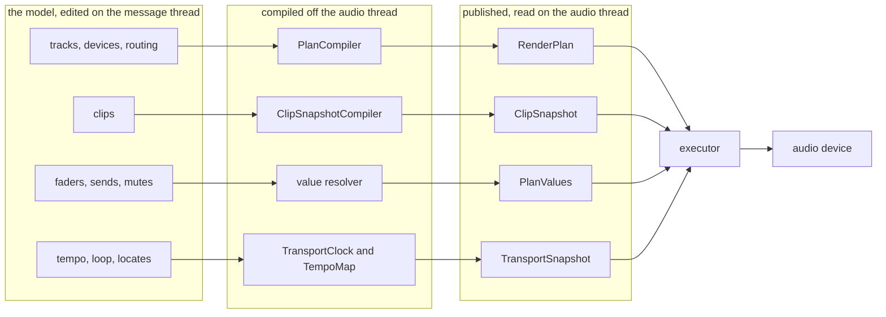
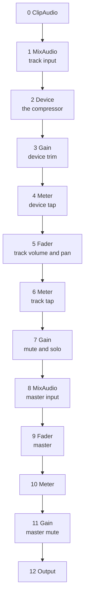
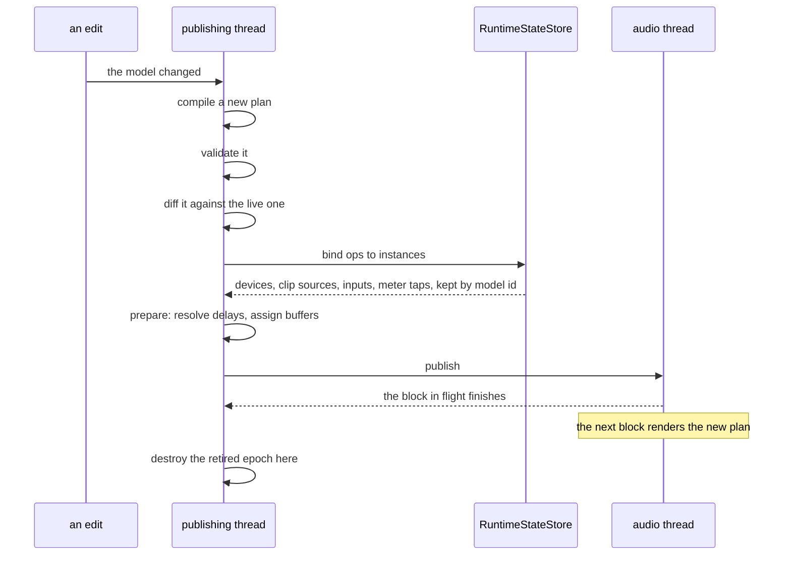
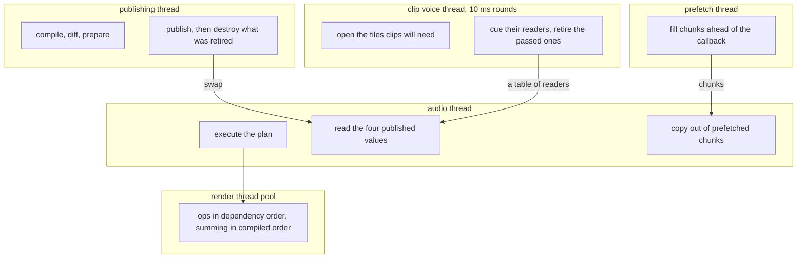
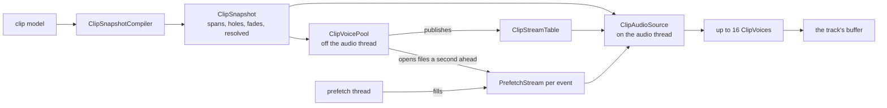
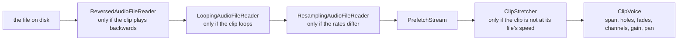

# The native audio engine

The native engine in `magda/engine/` is MAGDA's only audio engine. It shipped with v1 when
Tracktion Engine was removed ([#2928](https://github.com/Conceptual-Machines/magda-core/pull/2928)).
The epic is [#1882](https://github.com/Conceptual-Machines/magda-core/issues/1882).

`magda_engine` is a static library holding the plan, executors, clips, parameters, launcher and
inserts. A configure-time check in `magda/engine/CMakeLists.txt` refuses any file in there that
includes anything outside the model layer and its own headers. `EngineHost`
(`magda/daw/engine/host/`) wires it to the app: playback, session launching, recording, routing,
automation, insert capture, plugin state and editors.

This document is the map. The territory is the header comments: every file in `magda/engine/`
opens with a block that explains what it is for and why it is shaped the way it is. When the two
disagree, the headers are right and this file is stale.

---

## 1. Where it stands

| Part | Issue | State |
| --- | --- | --- |
| Engine core: plan, executor, PDC | [#1889](https://github.com/Conceptual-Machines/magda-core/issues/1889) | done |
| Arranger clip playback | [#1890](https://github.com/Conceptual-Machines/magda-core/issues/1890) | done |
| Parameters, modifiers, macros, automation | [#1891](https://github.com/Conceptual-Machines/magda-core/issues/1891) | done |
| Rack graph: pins, summing, multi-out, nesting | [#1892](https://github.com/Conceptual-Machines/magda-core/issues/1892) | done |
| External plugin hosting and hardware inserts | [#1893](https://github.com/Conceptual-Machines/magda-core/issues/1893) | done |
| Clip launcher and session playback | [#1894](https://github.com/Conceptual-Machines/magda-core/issues/1894) | done |
| Live input, monitoring, recording | [#1895](https://github.com/Conceptual-Machines/magda-core/issues/1895) | done |
| Validation harness | [#1896](https://github.com/Conceptual-Machines/magda-core/issues/1896) | done, native-only (section 7) |
| Cutover and Tracktion removal | [#1897](https://github.com/Conceptual-Machines/magda-core/issues/1897), [#2928](https://github.com/Conceptual-Machines/magda-core/pull/2928) | done |

---
## 2. The one idea

An audio callback may not wait, may not allocate and may not free. Everything else follows from
arranging the engine so it never has to.

So nothing the audio thread reads is ever edited. Four separate immutable values are compiled
off the audio thread and swapped in whole, and the audio thread only ever reads the current
one. They are separate because they change at wildly different rates, and lumping them together
would make a fader move cost what a device move costs.


```mermaid
flowchart LR
    subgraph model["the model, edited on the message thread"]
        T["tracks, devices, routing"]
        C["clips"]
        V["faders, sends, mutes"]
        M["tempo, loop, locates"]
    end

    subgraph compiled["compiled off the audio thread"]
        PC["PlanCompiler"]
        CC["ClipSnapshotCompiler"]
        VR["value resolver"]
        TC["TransportClock and TempoMap"]
    end

    subgraph live["published, read on the audio thread"]
        P["RenderPlan"]
        S["ClipSnapshot"]
        PV["PlanValues"]
        TS["TransportSnapshot"]
    end

    T --> PC --> P
    C --> CC --> S
    V --> VR --> PV
    M --> TC --> TS

    P --> EX["executor"]
    S --> EX
    PV --> EX
    TS --> EX
    EX --> OUT["audio device"]
```

What travels on which channel, and what it costs:

| Channel | Carries | Changes when | Cost of a change |
| --- | --- | --- | --- |
| `RenderPlan` | signal topology only | a device moves, a track is added, a chain is bypassed | a compile, at human speed |
| `PlanValues` | gains, faders, pans, sends, mutes | a mixer move | resolve a flat table, no compile |
| `ClipSnapshot` | what every track plays, resolved | a clip moves, is trimmed, is faded | recompile the snapshot, no plan touched |
| `TransportSnapshot` | tempo, loop, metronome, and where the transport has been asked to be | a tempo edit, a loop drag, a locate | published like the others |

The transport row is the one to read carefully, because its name invites the wrong reading. The
snapshot is the clock's **input**, not a per-block reading of it: where the timeline actually is
belongs to `TransportClock::advance`, which owns that cursor on the audio thread and exposes the
position separately. Nothing is published every block.

The rule of thumb, and the one worth remembering: **moving a clip or a fader never recompiles a
plan.** If a change to the model forces a plan recompile, either it really is topology or
something has been put in the wrong channel.

---

## 3. What a plan is

A flat, dependency-ordered list of ops. Not a graph of objects: a vector you walk from top to
bottom, where every op names the ops it reads from by index. That is what makes it dumpable,
diffable and schedulable.

Here is a real one, from the compiler's golden test: one track, one device, into the master.

```
magda-render-plan v1
ops=13 outputs=1
[  0] ClipAudio   det   T1:clipAudio                   in=-                out=audio       deps=0
[  1] MixAudio    det   T1:trackAudioInput             in=0:0              out=audio       deps=1
[  2] Device      det   T1/D7:deviceProcess            in=1:0,-,-          out=audio       deps=1
[  3] Gain        det   T1/D7:deviceGain               in=2:0              out=audio       deps=1
[  4] Meter       det   T1/D7:deviceMeter              in=3:0              out=audio       deps=1
[  5] Fader       det   T1:trackFader                  in=4:0,-            out=audio       deps=1
[  6] Meter       det   T1:trackMeter                  in=5:0              out=audio       deps=1
[  7] Gain        det   T1:trackMute                   in=6:0              out=audio       deps=1
[  8] MixAudio    det   T-2:trackAudioInput            in=7:0              out=audio       deps=1
[  9] Fader       det   T-2:trackFader                 in=8:0,-            out=audio       deps=1
[ 10] Meter       det   T-2:trackMeter                 in=9:0              out=audio       deps=1
[ 11] Gain        det   T-2:trackMute                  in=10:0             out=audio       deps=1
[ 12] Output      det   T-2:hardwareOutput             in=11:0             out=-           deps=1
ready=0
```

`T-2` is the master. `det` is the op's liveness domain: whether what it computes is the same
every time it is asked, or depends on something live arriving. It is read today, in two places.
`validatePlan` checks it both ways, so a deterministic op can never read a live one and a live
op can never appear without a live source behind it, and the crossfade pass refuses to introduce
a live producer ahead of a deterministic consumer. Its larger purpose is still ahead of it: the
anticipative executor ([#1898](https://github.com/Conceptual-Machines/magda-core/issues/1898))
is what the tag was carried from day one for.


```mermaid
flowchart TD
    A["0 ClipAudio"] --> B["1 MixAudio<br/>track input"]
    B --> C["2 Device<br/>the compressor"]
    C --> D["3 Gain<br/>device trim"]
    D --> E["4 Meter<br/>device tap"]
    E --> F["5 Fader<br/>track volume and pan"]
    F --> G["6 Meter<br/>track tap"]
    G --> H["7 Gain<br/>mute and solo"]
    H --> I["8 MixAudio<br/>master input"]
    I --> J["9 Fader<br/>master"]
    J --> K["10 Meter"]
    K --> L["11 Gain<br/>master mute"]
    L --> M["12 Output"]
```

Three things that look like clutter and are not:

**An ordinary device is four ops.** Its processing, its delta, its gain trim and its meter tap
are separate, so the differ can carry, rebuild and crossfade each independently. A device whose
trim changed does not rebuild.

Four is the usual shape rather than a rule: an analysis device is a transparent passthrough with
no trim, no tap and no difference to take, so it compiles to a bare process op, and a compile
with device meters switched off emits no meter ops at all.

**A device says how wide it is, and the chain wiring follows.** A plan port carries a channel
count as well as a kind (`PortDesc`), and a `Device` op says what it reads off the bus
(`PlanOp::audioInputChannels`) as well as what its output port carries. The counts come from the
plugin (`getChannelNames`), and they decide four things: a device reporting no audio input is not wired to the bus
at all, so the bus flows past it and its own slot ends nowhere; a device reporting no audio
output leaves nothing for the next stage to read; an instrument is never handed the bus, and its
slot ends in a `MixAudio` that sums it into whatever was already flowing rather than replacing
it; and a device narrower than the bus is handed only the channels it declared, its own output
widened back over the slot afterwards. That last part is why widths live on `Device` ops alone:
everything downstream reads a slot at the bus's width, so a width anywhere else would be
describing a boundary that is not there, and `validatePlan` says so.

A width describes a plugin, so where there is no plugin there is no width. A device nothing is
bound to stays the full-width passthrough it has always been, whatever the model last saw it
report: a device that failed to load must not fold the chain down on its way past.

That is also why a zero output count is never written to a project. The counts are persisted so
that a plan is right the moment a project opens, before every plugin has been instantiated, which
is why the capability flags beside them are persisted too. Those are only ever written when they
are true, so a stale one can loosen routing but never take it away, and a count that can silence
the chain behind it has to obey the same rule: zero comes back from the live plugin or not at
all, on the way in as well as on the way out.

The counts are asked only of a plugin in a position to answer. An external plugin fills neither
channel list while it has no `AudioPluginInstance`, so one still loading, or whose scan is
stale, reports nought in and nought out. The model is told once and keeps it, so writing that
reading down would wire a real device to no audio for the rest of the session.

What is untrusted is a missing instance, not an empty answer. Nought in and nought out is a real
reading for a MIDI-only plugin, and treating it as no answer would guess stereo and put the
plugin in the audio path. So the question asked is whether the plugin could answer, which only
an external one can fail.

**The delta is a `Subtract`,** between the processing and the trim, reading the device's output
and the dry signal the device was handed; a rack gets the same op one level up, around its own
fader. The dry edge is taken in front of whatever aligned the device's own input, so the
alignment it needs is an ordinary `Delay` on the subtract's own fan-in rather than a second
latency concept: what that delay resolves to is the whole distance the wet path travelled, the
processing's latency included.

It is in the plan whether or not anything is soloing that delta, and what the model decides is
only whether the subtraction happens (`OpValue::subtractsDry`). The delay on the dry edge is a
delay line, and a delay line is history: one that came into being at the moment the button was
pressed would hand back its own length in silence, so a device with any real latency would leak
its wet signal for that long and then step. Delta solo is therefore a value like mute, not structure like bypass, and
turning it on compiles nothing.

**Every op has a key.** `T1/D7:deviceGain` is the model location plus the structural role, and
`validatePlan` proves keys are unique. That key is how a new plan recognises an op in the old
one, which is the whole of section 4.

A key names the **innermost** rack: a device two racks deep is `T1/R8/C20/D7`, the rack and chain
it is in rather than the route down to it. That is what bounds what a nesting change costs.
Wrapping a device in a new rack re-keys that device's own ops and rebuilds the chain fader that
now reads the new instance; the rack around it, the chain beside it and the whole track above it
keep the keys they had and carry. Adding a level above an existing nesting re-keys nothing under
it at all. The seam steps rather than fades, because the op the old signal came from is one of the
ones that moved and the crossfade pass has no old side left to ramp from.
`tests/goldens/plan/edit-nest-device.txt` is that blast radius written out. The parameter system
resolves against the same rule from the other end - a macro on a device two racks deep belongs to
the nearer of them (`ParamKey`'s `fillScope`) - so a device and its parameters move together.

**A rack instance that contains itself is refused.** The model is a tree of owned values, so the
loop is in the ids rather than in the pointers: the same `RackId` open twice on one path.
Refused rather than depth-limited, because compiling it to any depth emits every op under the
loop a second time under the key it already has, and a duplicate key does not fail the differ,
it carries one op's runtime state into another. The instance is passed through the way a
bypassed one is and the cycle is named in the plan's diagnostics. Every walk the compiler makes
before emitting - what consumes MIDI, what a sidechain depends on, where an instrument is, and
the parameter table beside it - refuses the same instance, so a track is never ordered behind a
dependency the plan does not connect. The rule is stated once, in `plan/RackNesting.hpp`.

The op vocabulary is deliberately small: `ClipAudio`, `ClipMidi`, `AudioInput`, `MidiInput`,
`Device`, `MixAudio`, `MergeMidi`, `Subtract`, `Delay`, `Crossfade`, `Gain`, `Fader`, `SendTap`,
`Meter`, `ModSource`, `Output`.

**A device's sidechain is a slot fed from a modelled source** (#2329). The `Device` op's three
inputs are `[audio, MIDI, sidechain]`, and `SidechainConfig` says more than which track the key
comes from: `tapPoint` picks between the two points a modifier also chooses between, so a key
taken pre-FX reads the source's trigger tap and one taken post-fader reads its sidechain tap;
`gainDb` is a `Gain` op on the edge, emitted wherever a key is connected so moving the trim is a
value rather than a recompile; `listen` is a value on the process op, like a delta solo, and
replaces the slot's output with the key it was handed. Which slot a device wants is the device's
own declaration (`DeviceProperties::sidechain`), not something inferred from its channel counts.

---

## 4. The life of an edit


```mermaid
sequenceDiagram
    participant U as an edit
    participant P as publishing thread
    participant S as RuntimeStateStore
    participant A as audio thread

    U->>P: the model changed
    P->>P: compile a new plan
    P->>P: validate it
    P->>P: diff it against the live one
    P->>S: bind ops to instances
    S-->>P: devices, clip sources, inputs, meter taps, kept by model id
    P->>P: prepare: resolve delays, assign buffers
    P->>A: publish
    A-->>P: the block in flight finishes
    Note over A: the next block renders the new plan
    P->>P: destroy the retired epoch here
```

The parts that matter:

**The differ** (`plan/PlanDiff.hpp`) decides what survives. An op carries its state when the key,
the kind, the ports and the connected inputs all agree. That is what keeps delay lines full and
tails alive across an edit, and it is the answer to the rebuild click.

**The store** (`exec/RuntimeStateStore.hpp`) owns the expensive things an op resolves to:
devices, a track's clip sources, live inputs, meter taps. Keyed by model id rather than by plan
membership. A bypassed device contributes no ops at all, so keying on the plan would tear its
plugin down and rebuild it when you toggle bypass, losing tail, state and load time on a gesture
that should be free. Plan-named means playing; model-named means kept; only deletion from the
model destroys anything.

File readers are **not** here, and that is deliberate rather than an omission. A clip's readers
are opened and owned by `ClipVoicePool`, on its own thread, and reach the audio thread through
their own table; they never enter a plan epoch. Section 6 is where they live.

**Prepare** (`exec/PlanLayout.hpp`) is what a plan becomes when it meets the instances behind it.
How many samples each delay holds comes from what a loaded plugin reports, which the model
cannot know and the compiler never saw. A plugin whose latency changes therefore re-prepares
rather than recompiling.

**Publish** blocks the publishing thread until the audio thread finishes the block it is in.
That is the point: after it returns, nothing the audio thread can reach names the old epoch, so
the old epoch is destroyed right there, on the publishing thread. The callback never frees.

**Crossfade** (`plan/PlanCrossfade.hpp`) ramps the edges an edit moved. Fades are ops the
compiler never emitted, added by a pass over its output and gone again at the next publish.

**A note that is already sounding follows the edit.** Change a playing note's pitch and the
pitch changes under your fingers, because a voice renders what the published snapshot says
rather than what an event said when it started.

This is intended and nothing but a test would catch it being taken away: a render never edits
anything mid-note.


---

## 5. Who runs what


```mermaid
flowchart TB
    subgraph audio["audio thread"]
        A1["execute the plan"]
        A2["read the four published values"]
        A3["copy out of prefetched chunks"]
    end

    subgraph pub["publishing thread"]
        P1["compile, diff, prepare"]
        P2["publish, then destroy what was retired"]
    end

    subgraph pool["render thread pool"]
        W["ops in dependency order, summing in compiled order"]
    end

    subgraph voices["clip voice thread, 10 ms rounds"]
        V1["open the files clips will need"]
        V2["cue their readers, retire the passed ones"]
    end

    subgraph disk["prefetch thread"]
        D1["fill chunks ahead of the callback"]
    end

    P2 -->|"swap"| A2
    V2 -->|"a table of readers"| A2
    D1 -->|"chunks"| A3
    A1 --> W
```

The audio thread never allocates, never locks and never frees. Every other thread here exists so
that stays true.

The parallel executor deserves one line of its own: its output is **bit-identical** to the
single-threaded reference executor at every thread count, because everything that sums does so
in compiled order rather than in the order its inputs finished, and buffers are shared on a test
over the dependency graph rather than over the op list. The schedule costs nothing at run time,
because the dependency counts were baked into the plan when it was compiled.

---

## 6. How a clip plays


```mermaid
flowchart LR
    CM["clip model"] --> CC["ClipSnapshotCompiler"]
    CC --> SN["ClipSnapshot<br/>spans, holes, fades, resolved"]

    SN --> POOL["ClipVoicePool<br/>off the audio thread"]
    SN --> SRC["ClipAudioSource<br/>on the audio thread"]

    POOL -->|"opens files a second ahead"| ST["PrefetchStream per event"]
    POOL -->|"publishes"| TBL["ClipStreamTable"]
    TBL --> SRC
    PT["prefetch thread"] -->|"fills"| ST
    ST --> SRC

    SRC --> VO["up to 16 ClipVoices"]
    VO --> OUT["the track's buffer"]
```

The snapshot is **resolved**: occlusion, crossfades and takes are worked out once, at compile
time, by the same model functions the UI draws with (`computeAudibleSpans` in
`core/ClipOcclusion.hpp`, `effectiveFadesIn` in `core/ClipFades.hpp`). A voice therefore plays a span with fades and
never looks at its neighbours. Two clips crossfading are two voices each playing the fade it was
handed, and nothing downstream pairs them up.

The pool runs a second ahead of the transport (`kCueAheadSeconds`), opening files and pointing
readers at the sample their clip starts on. That is the difference between a clip starting on
the beat and a clip starting a block late: a read that does not continue the last one is a seek,
and a seek costs a block of silence.

Two ceilings, and they answer different questions through different counters.

`kMaxVoicesPerTrack` is 16, and it is how many clips a track can sound in one callback. Past it,
the pool reports `overSubscribed`, which is peak concurrency beyond the ceiling, and the source
reports `starvedVoices` as the clips actually go unheard.

`kMaxReadersPerTrack` is twice that, because a reader has to exist before its clip is due. Past
it, the counter is `unbridged`, and `overSubscribed` stays at zero by design: a lane of
sequential slices fills the reader budget many times over without two of them ever sounding
together. A crowded one-second window is normally harmless, so only clips the budget turned away
that start within `kReadAheadBridgeSeconds`, which is to say clips that will be due before the
next round, count as unbridged.

None of the three is silent about it, because silence nobody counted is indistinguishable from a
gap in the material.

### The reading chain

Reverse, looping and rate conversion are not processing. They are which of a file's samples
answer a position, so each is a reader wrapped around the reader, built once when the pool opens
a clip.


```mermaid
flowchart LR
    F["the file on disk"] --> R["ReversedAudioFileReader<br/>only if the clip plays backwards"]
    R --> L["LoopingAudioFileReader<br/>only if the clip loops"]
    L --> S["ResamplingAudioFileReader<br/>only if the rates differ"]
    S --> PS["PrefetchStream"]
    PS --> ST["ClipStretcher<br/>only if the clip is not at its file's speed"]
    ST --> V["ClipVoice<br/>span, holes, fades, channels, gain, pan"]
```

Everything above the chain sees one forward file at the device's rate, whatever the clip is set
to. A clip that asks for none of it reads through no extra layer at all.

### Speed and pitch

Slice 4 ([#2037](https://github.com/Conceptual-Machines/magda-core/issues/2037)). The chain
above decides **what** the reading holds; this decides **how fast it is consumed**, which is why
it sits above the stream where the chain sits below it.

All of it is one function. `readingPositionAt` in `clip/EventPlacement.hpp` says where in the
reading a moment of the timeline sits, and everything on the list is that function answering
differently:

| What the clip asks for | What the position does |
| --- | --- |
| its file's own speed | advances one reading sample per output sample |
| a speed ratio | advances by the ratio, a constant, resolved in the snapshot |
| auto tempo | advances by the beats that have passed, times a beat of the file |
| analog pitch | advances by the ratio the model already folded the pitch into, with no stretcher |
| a speed ramp fade | the moment itself is warped near the clip's edge, and the rate with it |
| warp markers | advances through a compiled map whose rate changes at every marker |

Auto tempo is the one worth reading twice. Its ratio is the project's tempo over the file's own
and moves with the tempo curve, so it cannot be resolved to seconds ahead of a block. What saves
it is that the integral of that ratio is beats: the material an instant has consumed is how many
beats have passed since the event began, times what a beat of the file is worth. That is why the
clock publishes both faces of one instant, and why there is no second tempo map on the audio
thread.

### Warp

Slice 5 ([#2038](https://github.com/Conceptual-Machines/magda-core/issues/2038)), and it added
no machinery at all below the position map: the voice, the stretchers and the reading chain are
untouched by it. A block already asks `readingPositionAt` at both its ends and hands the
difference to the stretcher, so a ratio that changes at every marker costs nothing that a moving
auto-tempo ratio did not already cost.

The model holds warp as `(sourceTime, warpTime)` pairs, piecewise linear, slope 1 outside the
marker range. That direction answers where a bit of file lands musically, which is what the
editors ask. Playback asks the inverse, so `clip/WarpMap.hpp` compiles one: sorted, strictly
increasing on both sides, and with whatever could not be part of a monotonic map dropped at
compile time with a diagnostic rather than divided by on the audio thread.

Three things compose with it, and each is decided in one place:

- **Reverse** stays a coordinate change, as it is everywhere else in this layer. The map is not
  mirrored; a reversed event walks it backwards from the far end of what it reads and mirrors the
  answer. Mirroring the map instead would need the length of the region the event reads, which is
  itself an answer from the map.

- **Looping** is the one case where the reading chain cannot do its own tiling. Folding below the
  stream works because the reading advances linearly, and under warp it does not: a position that
  had already been through the map would fold in the wrong domain and every pass after the first
  would play straight. So a warped loop folds in warp time, above the map, and the tiling below is
  switched off. The reading then saws back at each wrap rather than climbing, which costs one seek
  per pass.
- **Stretcher sizing** reads the map's steepest segment rather than its average. A warped event
  has no single rate, and the pre-roll has to cover the fastest stretch of it.

Where the markers come from when the user has not placed them is the other half of the slice.
`analysis/TransientDetector.hpp` feeds a file to the SDK's `sdk/analysis/TransientDetector.hpp`, a
coefficient-for-coefficient port of the detector earlier
projects were marked with -- envelope followers, a differentiator, a threshold from the
sensitivity, a spacing rule -- because a detector that found different transients would move
every auto-detected marker in every existing project. `io/SourceLoopInfo.hpp` is the third piece
and is not an analysis at all: a file's own tempo and beat count are an acid chunk that JUCE
already parses, so what the model seeds its interpretation from is a parse over a metadata map,
testable without a file.


A block then reads exactly `round(P(end)) - round(P(start))` samples and hands them to the
stretcher to come back as the block's own length, so the ratio a block runs at is whatever its
own two ends say. A tempo curve and a speed ramp therefore cost nothing extra, and nothing
accumulates: both ends are rounded rather than counted forward, so one block's reading ends
exactly where the next one's begins.

**Where a stretcher lives** answers the questions that come with it. One per provisioned event,
built and configured by `ClipVoicePool` on the thread that opens the file, carried to the
callback in the same table as the stream (`clip/ClipStreamFeed.hpp`). So a plan swap does nothing
to it, because it never enters a plan epoch; a loop wrap does nothing to it, because tiling
happens below the stream and a wrap is a discontinuity in the material rather than a change of
position; and a locate resets and re-primes something that already exists, which allocates
nothing. An event that asks for no stretch gets none, the same rule the reading chain follows.

**Latency is answered here rather than reported upwards.** Every engine wants material from
*before* the first sample to be heard, says how much, and the pool cues the stream that far back,
so a voice's first read is one contiguous read that begins with the priming samples. A
`ClipAudio` op therefore reports no latency at all and stretched voices stay aligned with
unstretched ones on the same track. The Signalsmith wrapper here primes with material *before*
the start, not at it. The corpus pins the resulting offset: measured by cross correlation, and
required to equal the stretcher's own reported priming latency scaled by the ratio it runs at. A
shift nobody predicted is a clip in the wrong place, and the case is refused rather than
aligned.


The engines are `third_party/signalsmith-stretch` (MIT, the default, and what the pinned mode
`kSignalsmith` names) and `third_party/soundtouch` (LGPL-2.1, its own replaceable static target,
carried because `kSoundTouchNormal` and `kSoundTouchBetter` are project-file integers and
sessions saved with them have to play as they were made). A clip that resamples instead of
stretching uses the same cubic curve the rate converter below the stream uses, so a file at
another rate and a clip playing fast are not two different sounds.

### MIDI clips

Slice 6 ([#2039](https://github.com/Conceptual-Machines/magda-core/issues/2039)). Audio and MIDI
share the snapshot, the span and the interior silences, and share nothing below that:
`clip/ClipMidiSource.hpp` has no file, no reader, no stretcher and no pool. What it has instead
is a question audio never has to answer.

**The invariant.** A note-off is never emitted for a note the source did not start, and never
withheld from one it did. `clip/ActiveNoteList.hpp` is what makes that structural rather than
careful, and it outlives every clip, block and plan that passes through the source because a
note does too. Five things end a note and only the first falls out of the material: a loop pass
running out or a clip's span ending; a locate or a wrap; a stop; a snapshot swap that moved or
deleted what was sounding; and destruction, which needs nothing, because a source dies with its
track and its output port goes with it.

**Compiled, not carried.** `clip/MidiEventList.hpp` is one sorted array of short messages in
content beats. The curve densification, the MPE channel assignment, the same-pitch overlap rule
and the two offsets resolve once, off the audio thread, exactly as an event's warp markers do.

**A loop is a coordinate change, not a copy.** A block is a beat range, and folding it through
the loop gives a handful of sub-ranges over the one list. The per-pass clipping rule puts every
note's off in the same pass as its on. Nothing reads a loop as a length, so the span is the
length.

**Groove is the one thing not resolved at compile time**, and it cannot be. It is anchored to
the project grid, so a clip whose loop length is not a whole multiple of the template's period
grooves each pass differently. So the table is compiled with the clip's strength folded in and
the lookup runs per pass, at emit time. The block's event search widens by the table's own
worst-case displacement, which it knows exactly.

**The chase is exact rather than nearly right**, and that follows from how curves densify.
Locating leaves every controller at the value its curve is at, which is the last event before
the instant. Because a message is emitted only when the quantised value changes, nothing emitted
since means nothing changed since, so the last event *is* the current value. Under a fixed grid
it would be up to a grid step stale and the synth would sit on the stale value until the next
point arrived.

**Controller density.** Messages go out on every change of the quantised value and no closer
together than about a millisecond, not on a 1/16-beat grid. A beat grid is anchored to the wrong
axis, which makes it both too dense and too sparse: a ramp of one unit over eight bars is 512
near-identical messages on it and two here, while a pitch-bend dive over a hundred milliseconds
gets three grid points at 120 BPM and about a hundred here. It also moves with tempo, running at
8 Hz at 30 BPM and 128 Hz at 480 for the same drawn curve, when smoothness is a wall-clock
property. The floor bounds the cost at about ten messages per block per controller (#1193).

`midiOffset` applies to a clip that does not loop.

---

## 7. How it is checked

**The corpus** ([#2040](https://github.com/Conceptual-Machines/magda-core/issues/2040), `tests/NullDiff*`)
is a set of projects built as model values and rendered offline by the native leg
(`tests/NullDiffNativeLeg.cpp`), runs in `magda_tests` under `[nulldiff]`, and prints its case
count in the canonical report. Nothing is golden: no reference render is checked in. The material
is chosen per case, never the tolerance: impulses and steps where sample-exact placement is
asserted, band-limited material where an interpolator or stretcher sits in the path.

**Each case declares a tier**, a determinism class following from what is in its path:

| Tier | What it asserts | Where it applies |
| --- | --- | --- |
| `None` | nothing; the MIDI comparison carries the case | the `midi.*` cases |
| `Exact` | residual under the floor, nothing allowed for | deterministic DSP, routing, the mixer |
| `Aligned` | one declared offset, undone, then `Exact` | anything whose whole effect is a delay |
| `Spectral` | pinned shift, envelope timing, magnitude bound | a phase vocoder in the path |
| `Invariants` | finite, equal length, bounded step, decayed tail | a plugin that owes nobody a sample |
| `Measured` | measured and printed, asserted only to be finite | `stretch.broadband` |

Whether captured MIDI streams are compared is a separate flag, so one project can assert both
audio and MIDI. The corpus-shape tests refuse a case that names a tier without the figure that
tier needs.

**Block-size invariance** (`tests/engine/test_null_diff_block_size.cpp`, `[blocksize]`,
[#2078](https://github.com/Conceptual-Machines/magda-core/issues/2078)): output is a function of
timeline position and nothing else. Every non-MIDI case renders at 64, 96, 512 and 4096 and the
other three are compared against 512. 96 is deliberately not a power of two: a voice drives a
stretcher in 128-sample cells anchored to where its event begins, and 96 rotates through every
phase of the cell grid. Internal-device projects are held to bit identity; a project hosting an
external plugin is compared within an epsilon it declares, refused on a project with no plugin.

**Properties over generated edits** ([#2077](https://github.com/Conceptual-Machines/magda-core/issues/2077),
`tests/PlanEdit*`, `magda_tests`): a seeded generator strings together the edits a user can
perform, each addressed by the id of what it touches, and failures shrink to the edits that
caused them. Four properties: carry (checked both ways against a signature built from the two
plans), retirement (`carriedFrom` is a partial injection whose complement is `retired`),
alignment (every fan-in arrives at one latency), and the null (a track no edit reaches records
the same samples with or without those edits). The ordinary run takes about eight seconds; the
deep sweep, `./magda_tests "[deep]"`, is four thousand sequences of forty edits and takes about
eight minutes. Use it when the differ or the crossfade pass changes.

**Plan goldens** ([#2076](https://github.com/Conceptual-Machines/magda-core/issues/2076)) pin
`dumpPlan` output, and the DAWproject round trip
([#2080](https://github.com/Conceptual-Machines/magda-core/issues/2080)) cross-checks project
export.

---

## 8. Device hosting

A device is MAGDA's, written against the device SDK, so the lifecycle adapter that runs one
belongs to the host, not the engine: `magda/daw/audio/plugins/engine/` (`magda_engine_devices`)
hosts a `MagdaDevice` behind a `Device` op. The boundary check on `magda_engine` keeps it out of
the engine, which would otherwise know what a MAGDA device is. A `Device` op that cannot be bound
is reported as a device the engine cannot run rather than passed through in silence.

---

## 9. Where the code lives

| Directory | What is in it |
| --- | --- |
| `plan/` | the IR, the compiler, the differ, the crossfade pass, the canonical dump |
| `exec/` | the two executors, the value table, the layout pass, the runtime store, the session, offline render |
| `clip/` | the clip snapshot and its compiler, the voice pool, the voices, the MIDI source, the feeds |
| `io/` | file readers, the prefetch stream and its thread, the reading chain, the placement mapping |
| `transport/` | the tempo map, the sample clock, the metronome |
| `tap/` | what a meter writes and the UI reads |

Every one of those files opens with a comment explaining why it exists. Read that before the
code; most of them answer the question you are about to ask.


---

## 10. Building and testing it

The engine target is on by default, so a normal build already builds it:

```
make debug
make test
```

Its tests are ordinary Catch2 model-level tests, tagged `[engine]`:

```
./cmake-build-debug/tests/magda_tests "[engine]"
```

Useful narrower tags while working on one part: `[plan]`, `[clip]`, `[exec]`, `[io]`,
`[transport]`, `[session]`, `[tap]`, `[offline]`, and inside those `[compiler]`, `[diff]`,
`[pdc]`, `[crossfade]`, `[voice]`, `[pool]`, `[stretch]`.

The corpus and its gates are in `magda_tests` too: `[nulldiff]` holds the comparators against
known-bad pairs, the corpus's declarations and the native leg, and `[blocksize]` inside it renders
the whole corpus four times and is the slowest thing in `magda_tests`. The trimmed-launch checks
run in `magda_juce_tests`:

```
make test-juce JUCE_TEST="Trimmed Session Launch"
```

Two properties the tests lean on and that are worth preserving:

**Plans and snapshots are canonical text.** `dumpPlan` and `dumpClipSnapshot` render them as
sorted, stable text, so a golden test is a diff of what the engine will play. A change that
alters either shows up as a readable diff rather than as a failing float comparison.

**Playback tests roll.** A test that skipped from one block to a distant one would be testing a
locate rather than playback, because a read that does not continue the last one is a seek. The
clip test rigs cue their readers where the transport is about to be, run the blocks in between,
and probe the one they care about.
