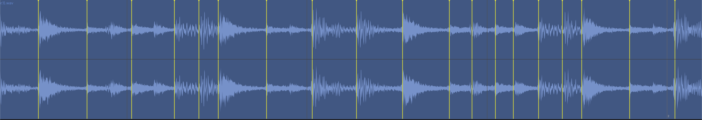
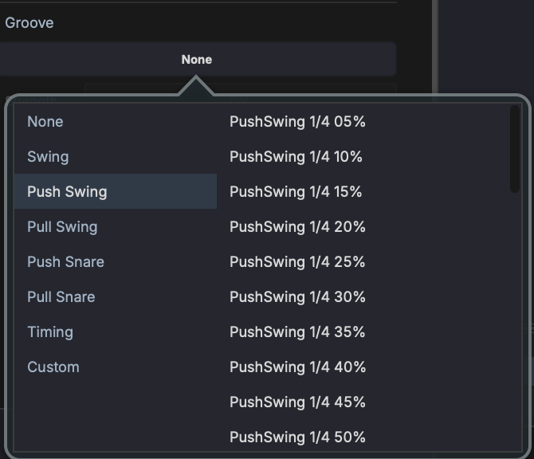
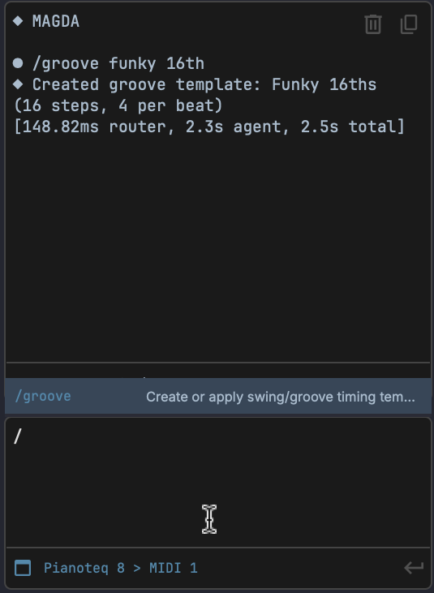

# Clips

Clips are the containers that hold audio and MIDI data on tracks. They appear as rectangular blocks in the Arrangement View timeline and as trigger pads in Session View.

## Clip Types

| Type | Description |
|------|-------------|
| **Audio** | Contains a reference to an audio file (WAV, AIFF/AIF, FLAC, OGG, MP3 where a platform decoder is available) with start/end points and gain |
| **MIDI** | Contains MIDI note and automation data |

Because MAGDA uses a [hybrid track system](tracks.md#hybrid-track-system), any track can hold both audio and MIDI clips.

## MIDI Clip Properties

| Property | Description |
|----------|-------------|
| **Name** | Display name of the clip |
| **Colour** | Clip colour in the editor |
| **Start** | Start position in beats |
| **Length** | Duration in beats |
| **Offset** | Non-destructive trim offset in beats |
| **Transpose** | Pitch shift from -24 to +24 semitones |

## Audio Clip Properties

| Property | Description |
|----------|-------------|
| **Name** | Display name of the clip |
| **Colour** | Clip colour in the editor |
| **Start** | Start position on the timeline |
| **Length** | Duration |
| **Offset** | Start position in the source file for non-destructive trimming |
| **Speed Ratio** | Playback speed factor (0.25x to 4.0x) |
| **Loop** | Enable looping with configurable loop start and length |
| **Warp** | Enable warp markers for per-segment time-stretching |
| **Auto Tempo** | Lock clip to project tempo (beat mode) |
| **Source BPM** | Original tempo of the source file |
| **Transpose** | Manual pitch shift from -24 to +24 semitones |
| **Auto-Pitch** | Automatic pitch tracking (Pitch Track, Chord Mono, Chord Poly) |
| **Analog Pitch** | Resample instead of time-stretch for pitch changes |
| **Volume** | Clip volume in dB |
| **Gain** | Additional boost from 0 to +24 dB |
| **Pan** | Stereo position from L to R |
| **Reverse** | Play audio backwards |
| **Fade In / Out** | Fade duration and curve type (Linear, Convex, Concave, S-Curve) |
| **Auto Crossfade** | Automatic crossfade with adjacent clips |

## Session Clip Properties

Both MIDI and audio clips in Session View have additional launch and follow properties:

| Property | Description |
|----------|-------------|
| **Launch Mode** | Trigger (one-shot) or Toggle (on/off) |
| **Launch Quantize** | Quantize launch timing (None, 8 Bars, 4 Bars, 2 Bars, 1 Bar, 1/2, 1/4, 1/8, 1/16) |
| **Follow Action** | What happens when the clip finishes: None, Play Next, Play Previous, Play Random, Stop, or Play Again |
| **Follow Delay** | Delay in beats before the follow action fires (0 - 64 beats, 0.25-beat resolution) |
| **Follow Loops** | Number of times the clip loops before the follow action fires |

!!! note
    Session clips do not have an absolute position property; they are not placed on the timeline. Their position is determined by the scene slot they occupy.

### Follow Actions

Follow actions chain session clips together for generative arrangement. Once the clip has played the configured number of loops (plus any follow delay), the chosen action fires:

- **Play Next** triggers the next slot in the same track column
- **Play Previous** triggers the previous slot in the same track column
- **Play Random** triggers another slot in the same track column at random
- **Play Again** retriggers the current clip
- **Stop** stops session playback

## Creating Clips

- **Double-click** an empty area on a track to create a new 1-bar MIDI clip at that position
- **Double-click** over a time selection to create a MIDI clip matching the selection length
- ++shift++ **+ drag** on an empty track lane to draw a MIDI clip of variable length. The drag distance sets the clip length (snapped to the current grid). Acts as a pencil tool.

## Selecting Clips

- **Click** a clip to select it
- ++cmd++ **+ click** (++ctrl++ **+ click** on Windows/Linux) to add or remove clips from the selection
- ++cmd+a++ (++ctrl+a++ on Windows/Linux) selects all clips in the arrangement, or all notes when a MIDI editor is focused

## Editing Clips

- **Move** — Drag a clip to reposition it on the timeline or move it to another track
- **Resize** — Drag the left or right edge of a clip to trim its start or end point
- **Duplicate** — Hold ++alt++ and drag a clip, or press ++cmd+d++
- **Duplicate with or without automation** — Right-click a clip and choose **Duplicate With Automation** to copy the clip together with the automation under it, or **Duplicate Without Automation** to copy just the clip. Plain **Duplicate** behaves the same as the menu's default.
- **Split** — Position the playhead and use **Edit > Split Clip** or press ++cmd+e++
- **Delete** — Select the clip and press ++delete++ or ++backspace++
- **Erase under cursor** — ++shift+ctrl++ **+ click** a clip to delete it directly without selecting first. If the clip is part of a multi-selection, the whole group is erased. Acts as a rubber tool.
- **Duplicate as ghost** — Right-click and choose **Duplicate as Ghost**, or hold ++alt+shift++ and drag, to create a linked copy. See [Linked (Ghost) Clips](#linked-ghost-clips).
- **Enable / disable** — Right-click and choose **Disable Clip** or **Enable Clip**, or press ++0++. See [Enabling and Disabling Clips](#enabling-and-disabling-clips).

## Cut, Copy, and Paste

- ++cmd+x++ — Cut the selected clip(s)
- ++cmd+c++ — Copy the selected clip(s)
- ++cmd+v++ — Paste at the playhead position on the same track

## Linked (Ghost) Clips

A ghost clip is a linked copy: every clip in a link group shares the same underlying content, so editing one updates them all. Use them for a chorus that repeats, a drum pattern reused across a song, or a riff you want to develop in one place and hear everywhere.

Create one by right-clicking a clip and choosing **Duplicate as Ghost**, or by holding ++alt+shift++ and dragging a copy off the original. (Plain ++alt++-drag makes an ordinary, independent duplicate.) The same command is available from the Edit menu as **Duplicate Clip as Ghost**.

Ghost clips are drawn translucently, with their waveform or notes dimmed, a small link glyph in the header, and an italic name with a per-instance index appended (e.g. *Riff #2*). A link group with only one clip left is inert and shows no ghost styling.

**What is shared, and what is not:**

| Shared across the group | Independent per clip |
|---|---|
| Notes and audio content, name | Position, length, and offset |
| Warp markers and time-stretch mode | Playback speed (speed ratio) and loop settings |
| Pitch, transpose, and auto-pitch | Colour |
| Groove, reverse, beat detection | Volume, gain, pan, and fades |
| | Launch and grid settings, enabled/disabled state |

Editing any shared field on one member mirrors instantly to the rest; the independent fields let each ghost sit in its own place, at its own level, without disturbing its siblings.

To detach a clip from its group, right-click it and choose **Make Unique**. The clip keeps its current content but stops tracking, and future edits to it (or to its former siblings) no longer propagate. Splitting a ghost clip detaches both halves automatically.

## Enabling and Disabling Clips

Disabling a clip removes it from playback without deleting it. Right-click a clip and choose **Disable Clip** (or **Enable Clip** to bring it back), or press ++0++ with clips selected. A disabled clip is covered by a heavy dark overlay, including its header, so it reads as "off" at a glance, and it is excluded from the playback graph so it produces no sound.

The enabled state is per-clip: disabling one member of a [link group](#linked-ghost-clips) does not silence its ghost siblings.

## Flatten MIDI Loop

When a MIDI clip is looping, right-click it and choose **Flatten MIDI Loop** to write the repetitions out as real notes. The loop cycles (including any offset phase) are baked into actual MIDI across the clip's full length, looping is switched off, and the offset resets to zero. The clip stays a MIDI clip in place, ready for per-note editing in the [Piano Roll](panels/piano-roll.md); the operation is a single undoable step.

## Audio Clip Modes

Audio clips have several playback modes that control how the clip responds to tempo changes and pitch adjustments. Set the mode in the clip's Inspector panel.

### Raw (Default)

The clip plays back at its original speed and pitch, unaffected by the project tempo. Changing the project tempo does not stretch or compress the clip. This is the simplest mode — what you recorded or imported is what you hear.

### Beat Mode

Locks the clip's length to a musical duration (e.g. 4 bars). When the project tempo changes, MAGDA time-stretches the audio so it always fills the same number of bars. Use this for loops, drum patterns, and rhythmic material that should stay in sync with the project.

### Repitch Mode

Adjusts playback speed to match tempo changes — like speeding up or slowing down a vinyl record. Faster tempo raises pitch, slower tempo lowers it. No time-stretching artefacts, but the pitch shifts with tempo. Useful for lo-fi effects or when pitch drift is acceptable.

### Warp Mode

Enables per-segment time-stretching using **warp markers**. Each marker pins a point in the audio to a specific position on the timeline. The audio between markers is independently stretched or compressed. This is the most flexible mode — use it to align a free-tempo recording to the grid, fix timing, or create creative effects.



- **Add a warp marker** — Double-click the waveform at the desired position
- **Move a warp marker** — Drag it left or right to shift that section of audio earlier or later
- **Delete a warp marker** — Double-click an existing marker, or right-click and select Remove

### Slicing

Right-click an audio clip to access slice operations. These split the clip into multiple pieces based on warp markers or the current grid setting.

- **Slice at Warp Markers In Place** — Split the clip at each warp marker position, creating separate clips on the same track. Requires warp mode with at least one user-placed marker.
- **Slice at Grid In Place** — Split the clip at every grid line, creating separate clips on the same track.
- **Slice at Warp Markers to Drum Grid** — Create a new Drum Grid track where each slice between warp markers becomes a pad, with a MIDI pattern that reproduces the original timing.
- **Slice at Grid to Drum Grid** — Same as above but slicing at grid intervals instead of warp markers.

### Time-Stretch Engine

When Beat or Warp mode is active (or whenever a clip is otherwise stretched or pitched), the audio is time-stretched by a selectable engine, set per clip:

| Engine | Notes |
|---|---|
| **Signalsmith** | Default. Modern, general-purpose stretcher with clean transients. |
| **SoundTouch** | Lighter-weight classic algorithm. |
| **SoundTouch HQ** | Higher-quality SoundTouch variant at more CPU cost. |
| **Off** | No stretch engine; the clip is left unprocessed. |

Choose the engine from the stretch mode dropdown in the clip **Inspector** (next to the WARP and BEAT toggles) or from the **Mode** dropdown in the [Waveform Editor](panels/waveform-editor.md)'s audio-clip properties. New clips default to **Signalsmith** as soon as stretching becomes active.

## Groove & Swing

Groove templates add a human feel to MIDI clips by shifting note timing away from the strict grid.

{ width="300" }

### Applying a Groove

1. Select a MIDI clip
2. In the **Inspector**, find the **Groove** section
3. Click the dropdown to open the groove picker
4. Select a category (Swing, Push Swing, Pull Swing, Push Snare, Pull Snare, Timing, Custom) and a template

The groove picker shows categories on the left and templates on the right. Templates include standard swing amounts (e.g. "PushSwing 1/4 05%" through "PushSwing 1/4 50%").

### Creating Grooves with AI

You can create custom groove templates using the `/groove` slash command in the AI Assistant:

{ width="400" }

```
/groove funky 16th
```

The AI generates a groove template based on your description. Created templates appear in the **Custom** category of the groove picker.

### Groove via DSL

You can also list and apply grooves using the DSL console:

```
groove.list()
groove.set(template="Basic 8th Swing", strength=0.5)
```

## Transcribe Audio to MIDI

MAGDA can detect the notes in an audio clip and turn them into MIDI. Right-click an audio clip and choose **Transcribe to MIDI**: the audio is analysed and a MIDI clip of the detected notes is created, ready to drive an instrument. It works on a single audio clip at a time and needs the clip's source file on disk.

Transcription works best on clearly pitched, reasonably clean material (a solo vocal, a bassline, a lead). Dense mixes and heavily layered audio give rougher results that usually want some cleanup in the [Piano Roll](panels/piano-roll.md).

## Crossfades

A crossfade is a real overlap between two adjacent audio clips: the outgoing clip fades down as the incoming clip fades up across the shared region.

- **Create** - drag one audio clip so it overlaps its neighbour. With auto-crossfade active the overlap becomes a crossfade, drawn with an X across the shared region. You can also right-click a clip and choose **Crossfade with previous clip** or **Crossfade with next clip**.
- **Resize** - drag the fade handles at a crossfaded edge to lengthen or shorten the overlap.
- **Read and edit the length** - the crossfade shows as an editable **XFADE** value in beats in the clip's fades section. Dragging it to zero leaves the row in place so you can re-create the crossfade later.
- **Remove** - right-click the clip and choose **Remove crossfade**.

New audio clips overlap into a crossfade automatically when **Auto-crossfade new audio clips** is on in [Preferences](interface/preferences.md). This is the same behaviour as the per-clip **Auto Crossfade** property in [Audio Clip Properties](#audio-clip-properties).

Selecting several audio clips at once keeps the [Waveform Editor](panels/waveform-editor.md) open in a multi-clip mode, where the fades section batch-edits all of them at once, including auto-crossfade.

## Freeze, Bounce, and Render

These operations render a track or clip's output to audio, useful for reducing CPU load or committing effects.

- **Freeze** — Render the track's output to a temporary audio file to free up CPU. The track becomes read-only until unfrozen. Use **Track > Freeze Track**.
- **Bounce in Place** — Render the track to a new audio clip that replaces the original content. Use **Track > Bounce in Place**.
- **Bounce to New Track** — Render the track's output to a new audio track, preserving the original track unchanged. Use **Track > Bounce to New Track**.
