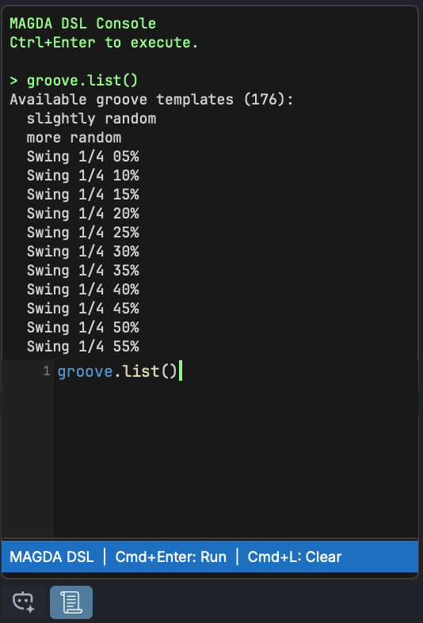
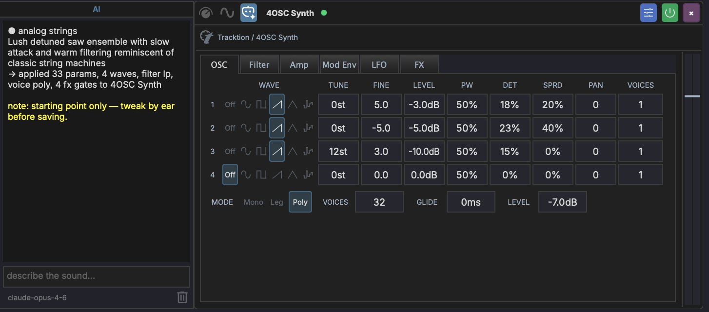

# AI Assistant

MAGDA includes a built-in AI chat assistant that lets you control the DAW using natural language, and a DSL console for direct scripting.

{ width="400" }

## Overview

The AI Assistant panel is located in the left panel. It has two tabs at the bottom: **AI** for natural-language interaction and **DSL** for direct script execution.

## AI Tab

Type a request in natural language and the assistant translates it into actions:

- "Add a MIDI track with a bass clip"
- "Transpose the selected notes up an octave"
- "Set the tempo to 120 BPM"
- "Mute tracks 3 and 4"

The assistant is **context-aware** — it knows which tracks, clips, and devices exist in your project and what is currently selected.

### Selection Context

At the bottom of the AI panel sits a context bar: an **icon** on the left and a **label** beside it. They do different jobs.

**The icon** controls whether your current selection is sent at all. When it is on (orange accent colour), the AI treats the selected track, clip, or device as the default target — a request like "add a bassline" with a track selected targets that track instead of creating a new one. Click it to toggle it off, and requests are interpreted without a default target.

Creating a new track still works either way — just be explicit in the request ("new track", "another track") when the icon is on.

**The label** opens a picker for attaching MIDI clips explicitly. It reads *Add MIDI context* when nothing is attached, and summarises what is attached otherwise (`Bass > Verse`, `Bass · all MIDI`, `6 MIDI · 3 tracks`).

### MIDI Context

Attaching MIDI sends the actual notes to the model, so it can answer about what you have written rather than guessing. Useful for "harmonise this", "write a counter-melody to these two parts", or "make the bass follow the chords in the piano clip".

Click the context label to open the picker:

- **Use selection** — attach the selected MIDI clips, or every MIDI clip on the selected tracks.
- **Clear** — detach everything.
- The list below shows each track with its MIDI clips indented underneath. Tick a clip to attach it, or a track to attach all of its clips. A track shows a dash instead of a checkmark when only some of its clips are attached.

Attaching context turns the selection icon back on. Audio clips cannot be attached — only MIDI. Clips deleted after being attached drop out of the set on their own.

!!! note "Bounded on purpose"
    However much you tick, MAGDA sends at most 16 clips, 128 notes per clip, and 256 notes in total, plus up to 32 chord annotations per clip. Selecting an entire project therefore cannot exhaust the model's context window — but it does mean a very large selection is sent in part rather than in full. Attach the clips that matter.

### How It Works

1. You type a natural-language request in the chat
2. The assistant translates your request into MAGDA's internal DSL (domain-specific language)
3. The DSL commands are executed as actions in the project
4. The assistant confirms what was done

### Setup

The AI Assistant supports both cloud LLM providers and a fully offline local model. Configure them in the **AI Settings** dialog (**Settings > AI Settings**); see [AI Settings](../interface/ai-settings.md) for the Cloud, Config, and Models tabs.

### Usage Tips

- Be specific: "Add a reverb to Track 2" works better than "make it sound spacey"
- The assistant can handle multi-step requests: "Create 4 MIDI tracks and name them Kick, Snare, HiHat, Bass"
- Use it for repetitive tasks: "Set all tracks to -6 dB"
- Prefix a message with `/dsl` to execute DSL directly from the AI chat without making an AI call

## Drummer Agent

When you select a track that hosts a [Drum Grid](../devices/drum-grid.md) (or a MIDI clip on one), the AI chat automatically switches into **Drummer** mode. The input area shows a drum icon and a `Drummer - <track name>` breadcrumb, and your requests are routed to a specialised agent that writes drum patterns instead of the general DAW assistant.

In this mode, describe the groove you want in plain language:

- "four on the floor with offbeat open hats"
- "a half-time hip-hop beat, snare on 3"
- "busier hats in the second bar"

The agent works in terms of drum **roles** (kick, snare, closed hat, and so on), so it places hits on the pads you have labelled with matching [roles](drum-grid-editor.md#row-labels-and-roles). If a Drum Grid clip is selected, its current pattern is sent along as context, so follow-up requests like "add a crash on the downbeat" build on what is already there. The generated pattern is written straight into the selected clip.

Drummer mode is automatic and context-driven; there is no slash command to type. Select a non-drum track to return to the general assistant.

## View Context

The console follows the view you are working in. The context label above the input box shows where your requests are routed:

- **Arrangement view** — requests go through the general assistant, which picks the right specialised agent for the task.
- **Session view** — requests are scoped to session workflows (scenes, clip slots, launching).
- **Mixer and master views** — requests are routed to the **mixing agent**.

Each view keeps its own conversation, so switching between Arrangement, Session, and Mixer picks up the thread you left in that view rather than mixing them together.

## Mixing Agent

In the mixer view, the console talks to a specialised mixing agent. It can read the per-track measurement layer — loudness, peaks, stereo width and correlation, and detected frequency collisions between tracks — and ground its feedback in those numbers.

Run an analysis from the mixer's [Analyze button](../mixer-view.md#mix-analysis) first; a **mix analysis ready** chip appears next to the console input once results exist. Then ask things like:

- "what is fighting with the bass?"
- "is the master loud enough for streaming?"
- "which tracks are mono-incompatible?"

The agent reads the measured findings rather than guessing from track names, and can suggest concrete moves (level trims, EQ areas to look at) based on them.

## DSL Tab

{ width="300" }

The DSL tab provides a code editor with **syntax highlighting** for the MAGDA DSL. It's designed for users who want to script DAW operations directly without going through the AI.

### Editor Features

- **Syntax highlighting** — keywords (blue), methods (yellow), parameters (light blue), strings (orange), numbers (green), note names (teal), comments (green)
- **Direct execution** — commands run immediately against the DAW with no network calls
- **Command history** — results appear in the output area above the editor
- **Keyboard shortcuts**:

| Shortcut | Action |
|----------|--------|
| ++cmd+enter++ (Mac) / ++ctrl+enter++ (Win) | Execute code |
| ++cmd+l++ (Mac) / ++ctrl+l++ (Win) | Clear output |

### Quick Start

Switch to the DSL tab, type a command, and press ++cmd+enter++:

```
track(name="Bass", new=true).clip.new(bar=1, length_bars=4)
```

Type `help` and execute to see available commands.

## DSL Quick Reference

A few common commands to get started. For the full language reference, see **[DSL Reference](../reference/dsl.md)**.

```
track(name="Bass", new=true).clip.new(bar=1, length_bars=4)
  .notes.add_chord(root=C4, quality=major, beat=0, length=4)
  .notes.add(pitch=E2, beat=0, length=1, velocity=100)
track(name="Bass").fx.add(name="compressor")
track(name="Bass").track.set(volume_db=-6)
groove.set(template="Basic 8th Swing", strength=0.5)
```

### Slash Commands

Prefix your message with a slash command to constrain the AI to a specific domain:

| Command | Description |
|---------|-------------|
| `/groove <request>` | Create or apply swing/groove timing templates |
| `/design <description>` | Generate a preset from a natural-language description and apply it to the focused device |
| `/theme <description>` | Generate a UI colour theme from a natural-language description and apply it live |
| `/controller <description>` | Generate a hardware [controller profile](../interface/controllers.md) from a description of the surface |
| `/agent <surface> <request>` | Send one request to a specific agent, overriding the view's usual routing |
| `/dsl <code>` | Execute [DSL](../reference/dsl.md) directly, with no AI call |

Typing `/` shows an autocomplete popup with available commands. Run a command with `--help` for its in-app cheat sheet.

#### `/agent` — Override Routing

Requests are normally routed by the view you are in (see [View Context](#view-context)). `/agent` overrides that for a single message when you want a different specialist:

```
/agent drummer busier hats in bar 2
/agent mixer tame the low mids on the bass
```

Available surfaces: `arrangement`, `piano-roll`, `session`, `mixer`, `automation`, `device`, `master`, `drummer`.

#### `/theme` - AI Theme Generator

Type `/theme <description>` to design a MAGDA colour theme from words - for example `warm sunset, dark`, `cold arctic blue`, `retro amber terminal`, or `cyberpunk neon on black`. The assistant produces a full palette, saves it as an editable JSON file in `Documents/MAGDA/Themes`, selects it, and applies it live.

The theme stays selected afterwards. Edit its `.json` on disk to tweak it - changes re-apply instantly - or switch themes at any time under **Preferences > Appearance**. See [Preferences - Theme](../interface/preferences.md#theme) for the theme file format and the manual load/template buttons.

Which model powers `/theme` is set by the **Theme** agent role in **AI Settings > Config** (Advanced mode).

#### `/design` — AI Sound Design

Select a sound generator, then type `/design <description>`. The assistant produces a preset and applies it directly to the focused device.

The chat shows a categorised summary of what changed, plus a one-line apply status. The preset name and category the AI chose become the default values when you save the preset from the device header — just click save and hit Enter.

Built-in safeguards:

- On 4OSC, a **master-level safety cap** estimates worst-case peak gain from the active oscillator count, distortion drive, and filter resonance, then clamps the master `level` to keep peaks in a sensible range. The AI's choices are only overridden when they would clip.
- The result is a **starting point**, not a final preset. Tweak by ear before saving.

For example prompts and recipes, see the [4OSC Synth — AI Sound Design](../devices/4osc.md#ai-sound-design-design) section.

## Per-Device AI Panel

Sound-design generation is also available without leaving the device chain. Every device slot exposes an **AI** icon in its header — click it to open a docked panel attached to that device.



The panel has three rows:

- **Output area** — streams the model's response token-by-token, then appends a one-line apply status (`→ applied N params, M waves, …`). The history persists across slot rebuilds (preset loads, plugin reloads, sidechain edits) — your last result stays put until you clear it.
- **Prompt input** — type a description and press ++enter++ to submit. Submitting cancels any in-flight generation on the same device.
- **Footer** — shows the active model id on the left and a delete button on the right. The delete button clears the chat for that device only.

Generations are scoped to the device the panel is mounted on. Devices with no agent behind them show **AI not supported for this device** in place of the prompt placeholder.

This is the same engine as the chat-based `/design` command — same agent, same safeguards, same preset name/category propagation to the save dialog. The panel is just a more direct path: focus the synth, prompt it, hear it.

### Which devices can be designed

| Device | What the agent writes |
|--------|-----------------------|
| **[4OSC](../devices/4osc.md)** | Waves, filter type, voice mode, FX gates, ADSR, levels |
| **MAGDA sound generators** — [Poly Synth](../devices/poly-synth.md), [FM0](../devices/fm0.md), [Physical Models](../devices/physical-models.md), [Mutable ports](../devices/mutable.md) | Any of the device's own parameters |
| **[Step Sequencer](../devices/step-sequencer.md)** and **[Poly Sequencer](../devices/poly-sequencer.md)** | A pattern rather than a preset |
| **[Faust](../devices/effects.md) devices** | DSP code — the prompt reads *describe an effect or instrument...* |
| **Third-party plugins** | The parameters you nominate — see [below](#ai-sound-design-for-third-party-plugins) |

Beyond 4OSC and the sequencers, which keep purpose-written agents, sound design works by **parameter introspection**: the agent reads the device's parameters at runtime — names, units, real-world ranges, and discrete choices — and asks the model for values in those real units (Hz, ms, dB, semitones) rather than in normalised 0–1 terms. That is why it generalises across devices without per-device tuning.

The [Sampler](../devices/sampler.md), [Drum Grid](../devices/drum-grid.md), and effects devices have no sound-design agent.

### AI sound design for third-party plugins

Third-party plugins can be designed too, but not automatically: a plugin exposing hundreds of opaque parameters gives the model nothing useful to work with. You choose what it is allowed to touch.

1. Right-click the plugin in the [Plugin Browser](browsers.md#plugin-browser) and choose **Configure Parameters…**.
2. Tick the **AI Agent** column for each parameter the designer should be able to set. This column is separate from **Visible** — a parameter can be hidden in the chain and still be available to the AI, or the other way round.
3. Optionally click **AI Prompt...** to add standing instructions for this plugin — how its oscillator sections are laid out, which parameters interact, anything the parameter names alone do not convey. The button gains a checkmark once a prompt is saved, and the text is prepended to every design request for that plugin.
4. Set units and ranges for the nominated parameters, either by hand or with **Detect** / **AI Detect**. The better the ranges, the more usable the generated values. See [Plugin Parameters](../plugin-parameters.md).

The **AI** icon appears on the device slot once at least one parameter is ticked. To hide it for a plugin you would rather drive by hand, right-click the plugin in the browser and untoggle **AI Sound Designer**; the setting is per plugin and persists.

## Param Aliases (`@`)

The AI chat understands **`@aliases`** as a shorthand for paths. Type `@` in the chat input to open an autocomplete list of available aliases — focused track, focused device, named macros, named modulators. Picking one expands to the full path the AI agent resolves.

Useful for tying a request to a specific scope without spelling the path out:

```
@focused.macro = 0.7
modulate @focused.cutoff with a slow LFO
```

Aliases are resolved server-side to the same `ChainNodePath` the DSL uses, so any command that takes a path takes an alias.
