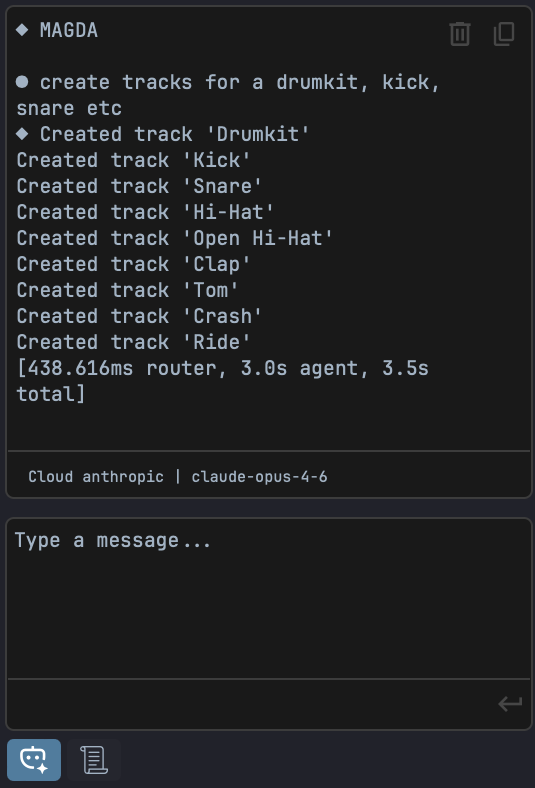

# AI Assistant

MAGDA includes a built-in AI chat assistant that lets you control the DAW using natural language, and a DSL console for direct scripting.

{ width="400" }

## Overview

The AI Assistant panel is located in the left panel. It has two tabs at the bottom: **AI** for natural-language interaction and **DSL** for direct script execution.

## AI Tab

Type a request in natural language and the assistant translates it into actions:

- "Add a MIDI track with a bass clip"
- "Transpose the selected notes up an octave"
- "Set the tempo to 120 BPM"
- "Mute tracks 3 and 4"

The assistant is **context-aware** — it knows which tracks, clips, and devices exist in your project and what is currently selected.

### How It Works

1. You type a natural-language request in the chat
2. The assistant translates your request into MAGDA's internal DSL (domain-specific language)
3. The DSL commands are executed as actions in the project
4. The assistant confirms what was done

### Setup

The AI Assistant uses the OpenAI API. You'll need an API key to get started.

1. Go to **Settings > Preferences > AI**
2. Enter your OpenAI API key

If you don't have an API key, you can generate one at [platform.openai.com/api-keys](https://platform.openai.com/api-keys).

### Usage Tips

- Be specific: "Add a reverb to Track 2" works better than "make it sound spacey"
- The assistant can handle multi-step requests: "Create 4 MIDI tracks and name them Kick, Snare, HiHat, Bass"
- Use it for repetitive tasks: "Set all tracks to -6 dB"
- Prefix a message with `/dsl` to execute DSL directly from the AI chat without making an AI call

## DSL Tab

The DSL tab provides a code editor with **syntax highlighting** for the MAGDA DSL. It's designed for users who want to script DAW operations directly without going through the AI.

### Editor Features

- **Syntax highlighting** — keywords (blue), methods (yellow), parameters (light blue), strings (orange), numbers (green), note names (teal), comments (green)
- **Direct execution** — commands run immediately against the DAW with no network calls
- **Command history** — results appear in the output area above the editor
- **Keyboard shortcuts**:

| Shortcut | Action |
|----------|--------|
| ++cmd+enter++ (Mac) / ++ctrl+enter++ (Win) | Execute code |
| ++cmd+l++ (Mac) / ++ctrl+l++ (Win) | Clear output |

### Quick Start

Switch to the DSL tab, type a command, and press ++cmd+enter++:

```
track(name="Bass", new=true).clip.new(bar=1, length_bars=4)
```

Type `help` and execute to see available commands.

## DSL Quick Reference

A few common commands to get started. For the full language reference, see **[DSL Reference](../reference/dsl.md)**.

```
track(name="Bass", new=true).clip.new(bar=1, length_bars=4)
  .notes.add_chord(root=C4, quality=major, beat=0, length=4)
  .notes.add(pitch=E2, beat=0, length=1, velocity=100)
track(name="Bass").fx.add(name="compressor")
track(name="Bass").track.set(volume_db=-6)
groove.set(template="Basic 8th Swing", strength=0.5)
```

### Slash Commands

Prefix your message with a slash command to constrain the AI to a specific domain:

| Command | Description |
|---------|-------------|
| `/groove <request>` | Create or apply swing/groove timing templates |

Typing `/` shows an autocomplete popup with available commands.
