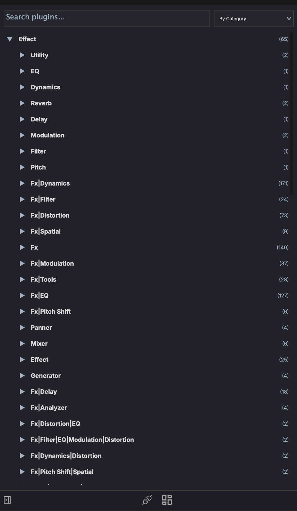
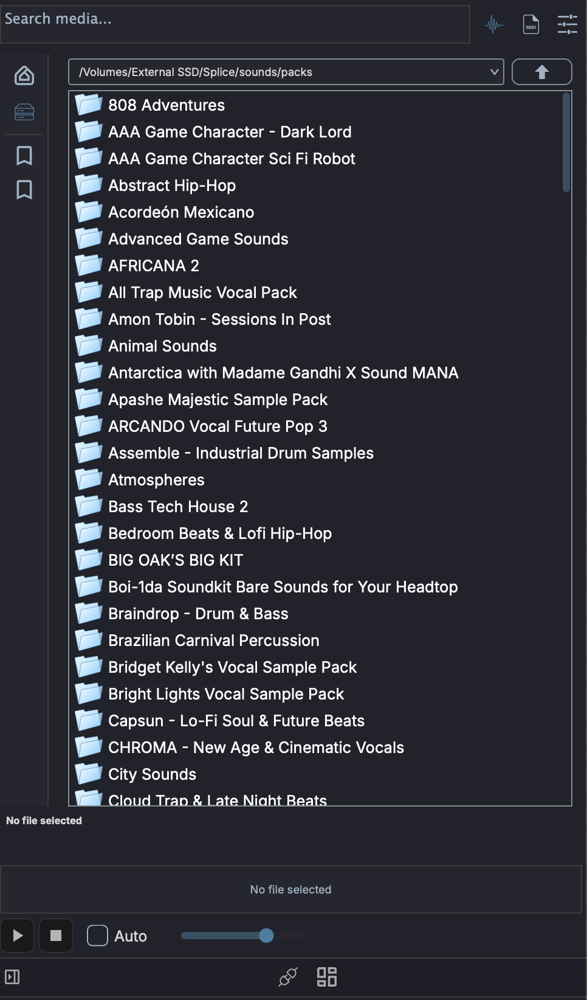

# Plugin & Media Browser

The left panel contains two browser tools for finding and adding content to your project.

## Plugin Browser

The Plugin Browser shows all available audio plugins organized in a tree view.

### Navigation

- **Tree view** — Plugins organized by manufacturer and category
- **Search** — Type to filter by plugin name
- **Favorites** — Star plugins for quick access
- **Folders** - Switch to a Folders view mode and organize plugins into your own folders. Folders stay in creation order and remain drop targets even when empty; an **Unfiled** bucket holds everything you have not filed.

### Adding Plugins

- **Drag and drop** — Drag a plugin from the browser onto a track header or into the FX chain to add it
- **Double-click** — Add the plugin to the currently selected track's FX chain

### Supported Formats

- VST3
- Audio Units (AU) — macOS only
- VST (legacy)

On macOS, when a plugin is installed as both VST3 and AU, the browser shows only your preferred format. See [Preferred Plugin Format](../interface/plugin-settings.md#preferred-plugin-format-macos).

### Rescanning

If a newly installed plugin doesn't appear, use **Settings > Plugin Scan** to re-scan your plugin directories.

## Media Explorer

The Media Explorer lets you browse files on your system and preview audio before importing.

!!! tip "Searchable library"
    The same panel has a **Library** mode that indexes folders into a searchable database, so you can find sounds by family, key, tempo, tags, or a plain-language description. See [Media Library](media-library.md).

### Navigation

- **File browser** — Navigate your file system with a tree view
- **Path bar** — Click to jump to a specific directory

### Preview

- Click an audio file to preview it through your monitor output
- Preview plays the file as it is on disk, at its own tempo and pitch. It is not stretched to match the project tempo, so a 90 BPM loop auditions at 90 BPM whatever the transport is set to. Drag the file onto a track if you want it to follow the project tempo
- With **Auto** on, ++arrowup++ / ++arrowdown++ step through results and audition each one as it is selected; ++arrowleft++ stops the preview and ++arrowright++ replays it from the start

The controls under the waveform drive the preview:

- **Play** / **Stop** - start the selected file from the beginning, or stop it. Play is greyed out until a file is selected
- **Volume** - preview level only. It is independent of the project's mixer and is not recorded into anything
- **Auto** - audition each file as soon as it is selected, instead of waiting for **Play**

Preview runs outside the project's mixer and goes straight to the output pair you nominate, so it keeps working while the transport is stopped. Choose that pair with the **Preview** toggle in [Audio Settings](../interface/audio-settings.md#channel-configuration).

### Filters

- Filter by file type (audio, MIDI, project)
- Sort by name, date, or size

### Importing

- **Drag and drop** — Drag files from the explorer onto a track or clip slot to import
- Supported audio formats: WAV, AIFF/AIF, FLAC, OGG, MP3 where a platform decoder is available
- Supported MIDI formats: .mid files

### Multi-Select

- ++shift++-click to extend the selection to a contiguous range
- ++cmd++-click (++ctrl++-click on Windows/Linux) to toggle individual files in and out of the selection
- Drag any file in the selection to drag the whole selection out

Drop targets vary by destination:

- [Arrangement View](../arrangement-view.md#multi-sample-drag-and-drop) — empty area creates one track per sample; existing track appends clips sequentially
- [Session View](../session-view.md#multi-sample-drag-and-drop) — empty area creates one track per sample stacked into scene rows; existing track stacks clips down consecutive scene slots
- [Drum Grid](../devices/drum-grid.md#multi-sample-drop) — samples fill consecutive pads from the drop target
